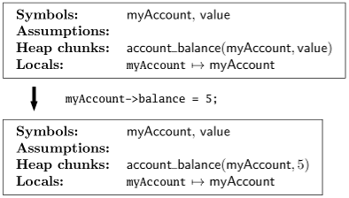

# プログラム検証器 VeriFast: チュートリアル

* 著者: Bart Jacobs, Jan Smans, Frank Piessens
* 所属: iMinds-DistriNet, Department of Computer Science, KU Leuven - University of Leuven, Belgium
* 元文書発行日時: February 15, 2017
* 元文書: http://people.cs.kuleuven.be/~bart.jacobs/verifast/tutorial.pdf
* 元文書リポジトリ: https://github.com/verifast/tutorial

## 1. 導入

VeriFast はシングルスレッドやマルチスレッドのC言語プログラム (VeriFast は Java もサポートしています; [VeriFast for Java: A Tutorial](https://people.cs.kuleuven.be/~bart.jacobs/verifast/verifast-java-tutorial.pdf) を読んでください) の性質が正しいことを検証するプログラム検証ツールです。
このツールは、1つ以上の .c ソースコードファイル (さらにそれらの .c ファイルから参照されている .h ヘッダファイル) から成るC言語プログラムを読み、「0 errors found  (エラーが見つからなかった)」とレポートするかエラーの可能性がある位置を示します。
もしこのツールが「0 errors found」とレポートしたなら、そのプログラムは次のようであることを意味しています
(このツールが時々「0 errors found」と間違ってレポートしてしまうのには (_不健全性_ (_unsoundnesses_) と呼ばれる) いくつかの理由があります;
https://github.com/verifast/verifast にある [soundness.md](https://github.com/verifast/verifast/blob/master/soundness.md) を読んでください。また知られていない不健全性もあるでしょう):

* 構造体インスタンスが解放された後にその構造体のフィールドを読み書きすることや、もしくは配列の終端を超えた読み書き (これは _バッファオーバフロー_ と呼ばれ、オペレーティングシステムやインターネットサービスにおけるセキュリティ脆弱性の最も多い原因です) のような、不正なメモリアクセスを行ないません。なおかつ
* データレース、すなわちマルチスレッドによる同じフィールドへの非同期な競合アクセス、として知られたある種の並行性のエラーを含みません。なおかつ
* 関数は、そのソースコード中の特殊なコメント (_注釈_ (_annotations_) と呼ばれます) でプログラマによって指示された、事前条件と事後条件に従っています。

不法なメモリアクセスやデータレースのようなC言語プログラムにおける多くのエラーは、テストやコードレビューのようなこれまでの手法では検出することが一般的にとても困難です。
なぜなら、それらはしばしば潜在的で、通常はわかりやすい故障を引き起こさず、そのくせ診断するのが困難な予測できない作用を持つからです。
けれども、オペレーティングシステム、デバイスドライバ、(電子商取引やインターネットバンキングを扱う) Web サーバ、自動車に対する組み込みソフトウェア、航空機、宇宙関連、原子力発電所や化学プラントなどのような、多くのセキュリティと安全性が要求されたプログラムはC言語で書かれます。
そしてこれらのプログラミングエラーはサイバー攻撃や損傷を可能にするのです。
そのようなプログラムにとって、VeriFast のような形式的な検証器によるアプローチは、要求されたレベルの信頼性を達成するもっとも効果的な方法になりえます。

全てのエラーを検出するために、VeriFast はプログラムに対して _モジュラーシンボリック実行_ (_modular symbolic execution_) を行ないます。
特に、VeriFast はプログラムのそれぞれの関数本体をシンボリックに実行します。
関数の事前条件によって表現された _シンボリック状態_ (_symbolic state_) から開始し、文によってアクセスされたそれぞれのメモリ位置に対してシンボリック状態中に _パーミッション_ (_permissions_) が存在するかチェックし、それぞれの文の作用を考慮するためにシンボリック状態を更新し、そして関数が返るときに最終的なシンボリック状態が関数の事後条件を満たすことをチェックします。
シンボリック状態は、あるメモリ位置へのアクセスに対する複数の (_チャンク_ (_chunks_) とも呼ばれる) パーミッションを含む _シンボリックヒープ_ (_symbolic heap_) と、それぞれのローカル変数へのシンボリック値 (symbolic value) を代入する _シンボリックストア_ (_symbolic store_)、そして現時点の実行パスのシンボリック状態で使われている _シンボル_ (_symbols_) の値に関する _仮定_ (_assumptions_) の集合である _パスコンディション_ (_path condition_) から構成されます。
シンボリック実行は常に停止します。
なぜならループ不変条件の使用のおかげで、それぞれのループ本体はたった一度だけシンボリックに実行され、関数呼び出しのシンボリック実行ではその関数の事前条件と事後条件だけを使い、その本体は使用しないからです。

筆者らは現在ツールの機能を少しずつ作成している最中です。
このチュートリアルにある例や練習問題を試してみたい方は、次の VeriFast ウェブサイトから VeriFast をダウンロードしてください:

* http://www.cs.kuleuven.be/~bartj/verifast/

`bin` ディレクトリに、コマンドラインのツール (`verifast.exe`) と GUI のツール (`vfide.exe`) が見つかるでしょう。

## 2. 例: illegal_access.c

どのように VeriFast を使用してテストやコードレビューで発見することが困難なプログラミングエラーを検出できるか説明するために、捉えにくいエラーを含むとても単純なC言語プログラムにこのツールを適用することからはじめましょう。

次からダウンロードできる `illegal_access.c` プログラムと一緒に `vfide.exe` を起動してくさださい:

http://www.cs.kuleuven.be/~bartj/verifast/illegal_access.c

VeriFast IDE にそのプログラムが表示されるでしょう。
そのプログラムを検査するために、__Verify__ メニューの __Verify program__ コマンドを選択するか、__Play__ ツールバーボタンを押すか、F5 キーを押してください。
図1のような結果になるでしょう。


__図1. illegal_access.c を開いた VeriFast IDE スクリーンショット__

このプログラムは _malloc_ を使って確保した構造体インスタンス `myAccount` のフィールド `balance` にアクセスしようと試みます。
けれども、もしメモリが不足していたら、_malloc_ はゼロを返してメモリは確保されません。
VeriFast はこのような場合に起きる不正なメモリアクセスを検出します。
次の GUI の要素に注意してください:

* 誤ったプログラムの要素が二重下線をともなって赤色で表示されます。
* "No matching heap chunks: account_balance" というエラーメッセージが表示されます。実際メモリが不足した場合には、プログラムがアクセスを試みるメモリ位置 (もしくは _ヒープチャンク_ (_heap chunk_)) はアクセス可能ではありません。`account_balance` は、構造体 `account` インスタンスの `balance` フィールドを表わすヒープチャンクの型です。
* 代入文が黄色バックグラウンドで表示されています。これはその代入文が _現在のステップ_ (_current step_) であるためです。関係するプログラム状態のシンボリック表現のトラックを保持しながら、そこへのステップで VeriFast はそれぞれの関数を検証します。VeriFast ウィンドウの左下コーナーの Steps ペインでステップを選択することで、それぞれのステップでのシンボリック状態を検査できます。その現在のステップに相当するプログラムの要素は黄色バッグラウンドで表示されます。シンボリック状態は、Assumptions ペインに表示された _パスコンディション_ (_path condition_) と; Heap chunks ペインに表示された _シンボリックヒープ_ (_symbolic heap_) と; Locals ペインに表示された _シンボリックストア_ (_symbolic store_) で構成されます。

このエラーを修正するために、コメント化された文のコメントをはずしてください。
そして再び F5 を押してください。
バーは緑色になるでしょう; これでこのプログラムは検証されました。
これは VeriFast が `main` 関数を実行する全てのパスをシンボリックに実行し、かつエラーが見つからなかったことを意味しています。

VeriFast がこの関数をどのようにシンボリックに実行するのか良く調べてみましょう。
VeriFast プログラムをシンボリックに実行した後、Trees ペインにそれぞれの関数に対する _シンボリック実行木_ (_symbolic execution tree_) を見ることができます。
この Trees ペインはデフォルトでは隠されていますが、VeriFast ウィンドウの右端の縁を左にドラッグすることで現われます。
Trees ペインの上部は、シンボリックに実行された全ての関数のドロップダウンリストです。
`main` 関数のシンボリック実行木を見るために、_Verifying function 'main'_ を選択してください。

シンボリック実行木は3種類のノードを持ちます:

* _先頭ノード_ (_top node_) はシンボリック実行の開始を表わします。先頭ノードをクリックしてください: シンボリック実行の初期状態では、ヒープチャンクは存在せず (Heap chunks ペインは空です)、ローカル変数も存在せず (Locals ペインは空です)、かつ仮定も存在しません (Assumptions ペインは空です)。
* シンボリック実行パスが2つのパスに分れる点に、それぞれ1つの _分岐ノード_ (_branch node_) があります。シンボリック実行で複数の場合が必要とされる時にこの分岐が発生します; そのためこれは _場合分け_ (_case split_) とも呼ばれます。`main` 関数のシンボリック実行は1つの場合分けを引き起こします: `malloc` 呼び出しのシンボリック実行は、メモリ不足のために `malloc` が NULL ポインタを返す分岐と、メモリに空きがあるため `malloc` が要求された量のメモリを確保して、そのポインタを返す分岐とに分かれます。(`if` 文をシンボリックに実行する時にも場合分けが起きますが、`if` 文の2つの場合と `malloc` 文の2つの場合は同一なので、別々の分岐ノードとして表示されません。)
* 関数を通るシンボリック実行パスの完了する端点に、それぞれ1つの _葉ノード_ (_leaf node_) があります。どれか葉ノードをクリックすると、Steps ペインに完全なシンボリック実行パスが見えるでしょう。`main` 関数は2つのシンボリックパスを持ちます: あるパスはメモリ不足のため `abort` 呼び出しによってプログラムが終了した時に終了します; もう1つのパスはメモリに空きがあるためその関数が返るときに終了します。

右端の葉ノードをクリックして、`malloc` がメモリ確保に成功する実行パスを表示させましょう。このとき VeriFast が `main` 関数のコード左端の余白に矢印を表示することに注意してください。この矢印はこのパスが `malloc` 文の2番目の場合と `if` 文の2番目の場合を実行することを表わしています。

VeriFast のシンボリック実行の詳細について理解を深めるために、上からこのパスを一歩ずつ見てみましょう。
Steps ペインの最初のステップを選択してください。
それから↓方向キーを押してください。
_Verifying function `main`_ ステップはシンボリック状態に影響を与えません。
_Producing assertion_ ステップは仮定 _true_ を Assumptions に追加します。
このチュートリアルの後で詳細に表明の生成と消費を考察することにします。
これで `malloc` 文に対する _Executing statement_ ステップに辿り着きました。
この文はシンボリック状態に3つの影響を与えます:

* ヒープチャンク _account\_balance(myAccount, value)_ と _malloc\_block\_account(myAccount)_ をシンボリックヒープに追加します。(これらは Heap chunks ペインに表示されます。) このとき、_myAccount_ と _value_ は未知の値を表わす _シンボル_ (_symbols_) です。具体的には、_myAccount_ は新しく確保した構造体インスタンスのメモリアドレスを表わし、_value_ はその構造体インスタンスの `balance` フィールドの初期値を表わします。(Javaでは新しいオブジェクトのフィールドはその型のデフォルト値で初期化されますが、C言語では新しく確保された構造体インスタンスのフィールドの初期値は不定値です。) VeriFast はシンボリック実行のステップでこれらのシンボルを _新しく採取します_。すなわち、新しい構造体インスタンスのアドレスと `balance` フィールドの初期値を表わすために、VeriFast はまだこのシンボリック実行パスで使われていないシンボルを使うのです。これを調べるために、以下に示す関数 `test` を検証してみてください。すると1番目の `malloc` 文をシンボリックに実行するために VeriFast はシンボル _myAccount_ と _value_ を採取し、次に2番目の `malloc` 文をシンボリックに実行ためにシンボル _myAccount0_ と _value0_ を採取したことに注意してください。

```c
void test()
    //@ requires true;
    //@ ensures true;
{
    {
        struct account *myAccount = malloc(sizeof(struct account));
        if (myAccount == 0) { abort(); }
    }
    {
        struct account *myAccount = malloc(sizeof(struct account));
        if (myAccount == 0) { abort(); }
    }
}
```

* 仮定 _myAccount ≠ 0_ (たぶん異なる表記になるでしょう) をパスコンディションに追加します。(これは Assumptions ペインに表示されます。) 実際、もし `malloc` に成功したら、返り値のポインタは NULL ではありません。
* シンボリックストア (Locals ペインに表示されます) に、ローカル変数 `myAccount` からシンボリック値 _myAccount_ への束縛を追加します。実際、このプログラムは (シンボル _myAccount_ で表わされた) `malloc` 呼び出しの返り値をローカル変数 `myAccount` に代入します。この場合ではローカル変数とシンボルは偶然にも同じ名前を持つのは偶然で、特殊な意味を持たないことに注意してください。

")

__図2. malloc 文のシンボリック実行 (1つ目の場合)__

")

__図3. malloc 文のシンボリック実行 (2つ目の場合)__

図3は成功した場合の `malloc` 文のシンボリック実行を要約しています。
図2は失敗した場合を要約しています。

このシンボリック実行トレースの次のステップは `if` 文のシンボリック実行です。
2つの場合が考えられるという点で、`if` 文は `malloc` 文に似ています;
そのため `if` 文に対しても、VeriFast は場合分けを行ない、シンボリック実行パスを2つの分岐に分けます。
1つ目の分岐では、VeriFast は `if` 文の条件は真である場合だと見なします。
さらにこの場合の仮定をパスコンディションに追加し、`if` 文の _then_ ブロックをシンボリックに実行します。
2つ目の分岐では、VeriFast は `if` 文の条件が偽である場合だと見なします。
さらに一致する仮定をパスコンディションに追加して、_else_ ブロックをシンボリックに実行します。
仮定をパスコンディションに追加した後、VeriFast は結果のパスコンディションに矛盾が検出されるか常にチェックすることに注意してください;
もし矛盾があったら、シンボリック実行パスはどのような実際の実行パスにも相当しません。そのためそのパスのシンボリック実行を継続せず、VeriFast はその実行を放棄します。
これは `malloc` が成功した後の `if` 文の1つ目の分岐で起きることです;
さらにそれは `malloc` に失敗した後の `if` 文の2番目の分岐でも発生します。

。シンボリック実行は if 文の then ブロックを実行します。")

__図4. if 文のシンボリック実行 (1つ目の場合)。シンボリック実行は if 文の then ブロックを実行します。__

。シンボリック実行は if 文の else ブロックを実行します。")

__図5. if 文のシンボリック実行 (2つ目の場合)。シンボリック実行は if 文の else ブロックを実行します。__

図4と図5は `if` 文のシンボリック実行の2つの場合を要約しています。

このシンボリック実行トレースの次のステップは、新しく確保した構造体インスタンスの `balance` フィールドに値 5 を代入する文をシンボリックに実行します。
構造体インスタンスのフィールドを代入するとき、最初に VeriFast は当該構造体インスタンスのフィールドを表わすヒープチャンクがシンボリックヒープに存在するかチェックします。
もし存在しなければ、検証に失敗し ``No such heap chunk'' とレポートします。
これはそのプログラムがまだ確保されていないメモリにアクセスしようとしたことをおそらく意味しています。
もしそのチャンクが存在したら、VeriFast はそのチャンクの2番目の引数を代入の右辺の値に置き換えます。
これは図6のようになるでしょう。



__図6. 構造体フィールドへの代入文のシンボリック実行__

最後に、`free` 文のシンボリック実行は `malloc` 文で追加された2つのヒープチャンク (`balance` フィールドを表わすチャンクと malloc_block チャンク) がまだシンボリックヒープに存在するかチェックします。
もし存在しなければ、VeriFast は検証に失敗します;
そのプログラムは既に解放済みの構造体インスタンスを解放しようとしているのかもしれません。
そうでなければ、図7に示すようにそのチャンクを削除します。
これはもしプログラムが構造体インスタンスを解放してからその構造体インスタンスのフィールドにアクセスしようと試みたら、そのフィールドにアクセスする文のシンボリック実行が失敗することを保証します。
(なぜならそのフィールドを表わすヒープチャンクが見つからないからです。)


__図7. free 文のシンボリック実行__

## 3. malloc_block チャンク

なぜ _malloc_ 文が `account_balance` チャンクと `malloc_block_account` チャンクの両方を生成するのかをより理解するために、ヒープに確保される代わりにスタック上のローカル変数として構造体インスタンスが確保されるようにプログラムを変更しましょう:

```c
int main()
    //@ requires true;
    //@ ensures true;
{
    struct account myAccountLocal;
    struct account *myAccount = &myAccountLocal;
    myAccount->balance = 5;
    free(myAccount);
    return 0;
}
```

はじめに、このプログラムはスタックに構造体 `account` のインスタンスを確保し、それを `myAccountLocal` と呼びます。
それからこの構造体インスタンスのアドレスをポインタ値 `myAccount` に代入します。
プログラムの残りは以前と同じです: プログラムは `balance` フィールドを値 5 に初期化し、それからその構造体インスタンスを解放しようと試みます。

もし VeriFast にこのプログラムを検証させると、VeriFast は _free_ 文で次のエラーをレポートします:

`No matching heap chunks: malloc block account(myAccountLocal addr)`

実際この _free_ は正しくありません。
なぜなら _free_ は `malloc` でヒープに確保された構造体インスタンスにのみ適用され、ローカル変数としてスタックに確保された構造体インスタンスには適用できないからです。

VeriFast はこのエラーを次のように検出します:
1) VeriFast は _malloc_ を使って確保された構造体インスタンスにのみ `malloc_block` チャンクを生成します。このチャンクはスタックに確保された構造体インスタンスを表わしません。
2) _free_ 文を検証するとき、その構造体が解放されるために VeriFast は `malloc_block` チャンクが存在することをチェックします。

その一方で、`account_balance` チャンクはどちらの場合も生成されることに注意してください。
結果的に、構造体インスタンスがヒープに確保されたかスタックに確保されたかどうかにかかわらず、`balance` フィールドを初期化する文は検証に成功します。

## 4. 関数と契約

前の章の例からはじめます。
今の時点ではこの例は唯一1つの関数から成ります: それは main 関数です。
別の関数を追加してみましょう。
`account` 構造体インスタンスのアドレスと整数の金額を取り、その金額を構造体インスタンスの `balance` フィールドに代入する関数 `account_set_balance` を書きます。
そして main 関数のフィールド代入をこの関数呼び出しで置き換えます。
プログラムは以下のようになります:

```c
#include "stdlib.h"

struct account {
    int balance;
};

void account_set_balance(struct account *myAccount, int newBalance)
{
    myAccount->balance = newBalance;
}

int main()
    //@ requires true;
    //@ ensures true;
{
    struct account *myAccount = malloc(sizeof(struct account));
    if (myAccount == 0) { abort(); }
    account_set_balance(myAccount, 5);
    free(myAccount);
    return 0;
}
```

新しいプログラムを検査すると、VeriFast はこの新しい関数が契約を持っていないとエラーを出します。
実際、VeriFast はそれぞれの関数を別々に検査します。
そのため、それぞれの関数に関数呼び出しの初期状態と最終状態を表現する事前条件と事後条件が必要です。

main 関数が持つのと同じ契約を追加しましょう:

```c
void account_set_balance(struct account *myAccount, int newBalance)
    //@ requires true;
    //@ ensures true;
```

全ての VeriFast 注釈と同様に、契約はコメント中に置かれるので、C言語コンパイラはそれらを無視することに注意してください。
(@) 記号でマークされたコメントを除いて、VeriFast もコメントを無視します。

これでもはや VeriFast は契約の欠落に関するエラーを出さなくなりました。
けれども今度は、`account_set_balance` 本体のフィールド代入が検査できないというエラーが出ます。
なぜなら、そのシンボリックヒープはこのフィールドへのアクセスを許可するヒープチャンクを含まないからです。
これを修正するために、関数の事前条件で、その関数がアドレス `myAccount` の `account` 構造体インスタンスの `balance` フィールドへのアクセスに対する許可を要求することを明記しなければなりません。
事前条件にヒープチャンクを書くことで、この修正を行ないましょう:

```c
void account_set_balance(struct account *myAccount, int newBalance)
    //@ requires account_balance(myAccount, _);
    //@ ensures true;
```

フィールドの値がある位置にアンダースコアを使っていることに注意してください。
これは、この関数が呼び出された時に、そのフィールドの古い値について関心がないことを示しています。
(また VeriFast はフィールドチャンクに対してより簡潔な構文をサポートしています。
例えば、`account_balance(myAccount, _)` は `myAccount->balance |-> _` と書くこともできます。
実際には一般に、後者の (フィールドチャンク固有の) 構文は前者の (総称チャンク) 構文よりも推奨されています。
なぜならそれは VeriFast に、与えられたフィールドを表わすチャンクが最大1つあり、そのフィールドの値がその型の制限内であるというフィールドチャンク固有の情報を考慮させるからです。
けれども、注釈に書かれたチャンクと VeriFast IDE で表示されるヒープチャンクが同じ見た目になるように、このチュートリアルでは初めは総称チャンク構文を使います。)

これで VeriFast は関数本体を閉じる括弧をハイライトします。
これはフィールド代入の検証に成功したことを意味しています。
けれども、VeriFast はこの関数がヒープチャンクをリークしているというエラーを表示します。
さしあたって単純に、このヒープチャンクのリークを許すことを示す `leak` コマンドを挿入してこのエラーメッセージを回避しましょう。
後にこの問題に戻ってくることにします。

```c
void account_set_balance(struct account *myAccount, int newBalance)
    //@ requires account_balance(myAccount, _);
    //@ ensures true;
{
    myAccount->balance = newBalance;
    //@ leak account_balance(myAccount, _);
}
```

これで関数 `account_set_balance` は検査され、VeriFast は関数 `main` を検査しようと試みます。
この検査は `account` 構造体インスタンスを解放できないというエラーを出力します。
なぜなら、`balance` フィールドへのアクセス許可を持たないからです。
実際、そのシンボリックヒープは `malloc_block_account` チャンクを含みますが、`account_balance` チャンクを含みません。
何が起きたのでしょうか？
シンボリック実行パスをステップ実行して調べてみましょう。
2番目のステップを選択します。
`malloc` 文が実行されようとしており、そのシンボリックヒープは空です。
次のステップを選択します。
`malloc` 文が `account_balance` チャンクと `malloc_block_account` チャンクを追加しました。

_if_ 文は作用がありません。

そうして `account_set_balance` を呼び出します。
この実行ステップは "Consuming assertion" と "Producing assertion" という名前の2つの子ステップを持つことに気が付くでしょう。
関数呼び出しの検証は、関数の事前条件の _消費_ (_consuming_) とその後の関数の事後条件の _生成_ (_producing_) から成ります。
事前条件と事後条件は _表明_ (_assertions_)、すなわち通常の論理に加えてヒープチャンクを含むような式です。
事前条件の消費は、その関数から要求されたヒープチャンクをその関数に渡すことを意味し、従ってそれらをシンボリックヒープから削除します。
事後条件の生成は、その関数が返るときにその関数から提示されたヒープチャンクを受け取ることを意味し、従ってそれらをシンボリックヒープに追加します。


"Consuming assertion" ステップを選択すると VeriFast ウィンドウのレイアントが変わります (図8を見てください)。
ソースコードペインが2つの部分に分かれます。
上の部分は呼び出された関数の契約を表示するのに使われ、下の部分は検査される関数を表示するのに使われます。
(この例では呼び出される関数は検査される関数と近接しているので、上と下のパートは同じものが表示されます。)
検査される呼び出しが緑色バックグラウンドで表示されます。
消費/生成される契約は黄色バックグラウンドで表示されます。
"Consuming assertion" ステップから "Producing assertion" ステップに移ると、"Consuming assertion" ステップがシンボリックヒープから `account_balance` チャンクを削除することに気が付くでしょう。
ここでは概念上、`main` 関数が `account_set_balance` 関数の返りを待つ間、それはこの関数によって使われます。
関数 `account_set_balance` の事後条件はヒープチャンクに言及していないので、"Producing assertion" ステップはシンボリックヒープに何も追加しません。

ここでは VeriFast が `account_set_balance` がヒープチャンクをリークしたとエラーを出すのかは明確です:
この関数は `account_balance` チャンクをその呼び出し元に返さないため、そのチャンクは失われ、そのフィールドは再びアクセスすることができないのです。
これは通常プログラマの意図ではないので、VeriFast はこれをエラーとみなします;
さらに、より多くのメモリ位置がリークしたら、そのプログラムはメモリ不足になるでしょう。

このエラーを修正する方法も明確です:
関数 `account_set_balance` の事後条件にこの関数が `account_balance` チャンクを呼び出し元に返すことを指定すべきです。

```c
void account_set_balance(struct account *myAccount, int newBalance)
    //@ requires account_balance(myAccount, _);
    //@ ensures account_balance(myAccount, newBalance);
{
    myAccount->balance = newBalance;
}
```

これはリークエラーメッセージと _free_ 文のエラーを取り除きます。
これでこのプログラムは検査されました。
フィールドの値が属する位置で `newBalance` パラメータを参照していることに注意してください;
これは関数が返る時のこのフィールドの値がこのパラメータの値と等しいことを意味しています。

__練習問題 1__
`account` 構造体インスタンスの生成と破棄を関数に切り出してください。
その生成関数は `balance` をゼロで初期化すべきです。
注意: 表明で複数のヒープチャンクを使うには、それらを分離積 `&*&` (アンパサンド-スター-アンパサンド) を使って区切ってください。
また事後条件では関数の返り値を `result` の名前で参照できます。

## 5. パターン

現在の `balance` を返す関数を追加し、それを main 関数で使ってみましょう。
次のコードが最初の試みです:

```c
int account_get_balance(struct account *myAccount)
    //@ requires account_balance(myAccount, _);
    //@ ensures account_balance(myAccount, _);
{
    return myAccount->balance;
}

int main()
    //@ requires true;
    //@ ensures true;
{
    struct account *myAccount = create_account();
    account_set_balance(myAccount, 5);
    int b = account_get_balance(myAccount);
    assert(b == 5);
    account_dispose(myAccount);
    return 0;
}
```

新しい関数の検査は成功しますが、VeriFast は条件 `b == 5` を証明できないというエラーを返します。
VeriFast は条件のチェックを要求されると、はじめに、それぞれの変数をシンボリック値で置換することで、その条件を論理式に変換します。
Locals ペインに表示されたシンボリックストアに、変数 `b` のシンボリック値が論理記号 `b` であることを見つけることができます。
そのため、結果の論理式は `b == 5` です。
それから VeriFast は _パスコンディション_ 、すなわち Assumptions ペインに表示されている式、からこの式を導出しようと試みます。
この場合唯一の仮定は __true__ なので、VeriFast はこの条件を証明できないのです。

この問題は関数 `account_get_balance` の事後条件はこの関数の返り値を指定していないことによります。
その返り値が関数が呼ばれたときの `balance` フィールドの値と等しいと言明していないのです。
これを修正するために、関数が呼ばれたときの `balance` フィールドの値に名前を代入できるようにする必要があります。
これは事前条件のアンダースコアを _パターン_ `?theBalance` で置換することで可能です。
これで名前 `theBalance` は `balance` フィールドの値に束縛されるようになります。
この名前は事後条件中で、等価条件を使う返り値を指定するために使うことができます。
関数の返り値はその関数の事後条件で `result` の名前で使えます。
表明における論理条件とヒープチャンクは分離積 `&*&` を使って区切ってください。

```c
int account_get_balance(struct account *myAccount)
    //@ requires account_balance(myAccount, ?theBalance);
    //@ ensures account_balance(myAccount, theBalance) &*& result == theBalance;
{
    return myAccount->balance;
}
```

事後条件のフィールド値の位置で使うことで、名前 `theBalance` はその関数が `balance` フィールドの値を修正しないことを指定するのにも使えることに注意してください。

これでこのプログラムは検査されました。
実際、__Run to cursor__ コマンドを使って assert 文まで実行すると、Assumptions ペインに仮定 `(= b 5)` が現われるでしょう。
ステップを戻すと、関数 `account_get_balance` の事後条件における等式条件が生成されたときに、その仮定が追加されたことが分かるでしょう。
さらにステップを戻すと、フィールドチャンクの表明が消費されたときに、上の Locals ペインに変数 `theBalance` が追加され、その値が 5 に束縛されたことが分かるでしょう。
シンボリックヒープに値が見つかったので、それは値 5 に束縛されます。
関数呼び出しを検査するとき、上の Locals ペインはその呼び出される関数の契約を評価するのに使われます。
初期状態ではそれはその関数のパラメータからその呼び出しで指定された引数への束縛を含んでいます;
追加の束縛は契約にパターンを記述すると現われます。
仮定 `(= b 5)` は、上の Locals ペインで示されたシンボリックストアで、等式条件 `result == theBalance` を評価して得られる論理式です。

__練習問題 2__
与えられた金額を `account` に預ける関数を追加してください。
次の `main` 関数を検証してください。

```c
int main()
    //@ requires true;
    //@ ensures true;
{
    struct account *myAccount = create_account();
    account_set_balance(myAccount, 5);
    account_deposit(myAccount, 10);
    int b = account_get_balance(myAccount);
    assert(b == 15);
    account_dispose(myAccount);
    return 0;
}
```

注意: VeriFast は算術オーバーフローをチェックします。
ここでは、__Verify__ メニューでこのチェックを無効にしてください。

__練習問題 3__
`account` の最小 `balance` を指定するために、構造体 `account` にフィールド `limit` を追加してください。
(これは一般にゼロもしくは負の数になります。)
この `limit` は生成時に指定します。
さらに与えられた金額を `account` から引き出す関数を追加してください。
この関数は `limit` を配慮しなければなりません;
要求された金額の引き出しが `limit` に違反したら、`limit` の違反を除いて引き出し可能な最大の金額が引き出されます。
その関数は実際に引き出された金額をその返り値として返します。
C言語の条件式 `condition ? value1 : value2` を使うことになるでしょう。
関数 `account_set_balance` を削除してください。
フィールドチャンク `myAccount->balance |-> value` の略記を使ってください。
次の `main` 関数を検査してください。

```c
int main()
    //@ requires true;
    //@ ensures true;
{
    struct account *myAccount = create_account(-100);
    account_deposit(myAccount, 200);
    int w1 = account_withdraw(myAccount, 50);
    assert(w1 == 50);
    int b1 = account_get_balance(myAccount);
    assert(b1 == 150);
    int w2 = account_withdraw(myAccount, 300);
    assert(w2 == 250);
    int b2 = account_get_balance(myAccount);
    assert(b2 == -100);
    account_dispose(myAccount);
    return 0;
}
```

## 6. 述語

練習問題3で得られたプログラムからはじめましょう。
先の契約が成長するのを観察しました。
さらに `account` の "クラス" と、異なるモジュールである main 関数を考えると、`account` モジュールの内部実装詳細が main 関数に露出されてしまっています。
関数の契約に `account` 構造体インスタンスを表現する _述語_ (_predicate_) を導入することで、情報の隠蔽とより簡潔な契約を実現できます。

```c
/*@
predicate account_pred(struct account *myAccount, int theLimit, int theBalance) =
    myAccount->limit |-> theLimit &*& myAccount->balance |-> theBalance
    &*& malloc_block_account(myAccount);
@*/
```

述語は名前の付いたパラメータ化された表明です。
さらにそれはヒープチャンクの新しい型を導入します。
`account_pred` ヒープチャンクは、`account_limit` ヒープチャンク、`account_balance` ヒープチャンクと `malloc_block_account` ヒープチャンクを1つにまとめています。

この述語を使って、引き出し関数の契約を書き換えてみましょう。
最初の試みは次のようになります:

```c
void account_deposit(struct account *myAccount, int amount)
    //@ requires account_pred(myAccount, ?limit, ?balance) &*& 0 <= amount;
    //@ ensures account_pred(myAccount, limit, balance + amount);
{
    myAccount->balance += amount;
}
```

この関数は検査できません。
シンボリックヒープに `account_balance` ヒープチャンクがないので、`balance` フィールドの更新は検査できないのです。
そこには `account_pred` ヒープチャンクしかありません。
`account_pred` ヒープチャンクは `account_balance` ヒープチャンクをカプセル化していますが、VeriFast は述語 `account_pred` を自動的に分解しません。
__open__ ゴースト文を挿入して、VeriFast に述語ヒープチャンクを分解するよう指示する必要があります:

```c
void account_deposit(struct account *myAccount, int amount)
    //@ requires account_pred(myAccount, ?limit, ?balance) &*& 0 <= amount;
    //@ ensures account_pred(myAccount, limit, balance + amount);
{
    //@ open account_pred(myAccount, limit, balance);
    myAccount->balance += amount;
}
```

これでこの代入は検査されましたが、VeriFast は事後条件で停止します。
それは関数の呼び出し元へ返す `account_pred` ヒープチャンクが見つからないと訴えています。
`account_pred` チャンクを構成するチャンクはシンボリックヒープ中に存在しますが、VeriFast は自動的にそれらを `account_pred` チャンクにまとめません。
__close__ ゴースト文を使ってそれを行なうよう VeriFast に指示する必要があります:

```c
void account_deposit(struct account *myAccount, int amount)
    //@ requires account_pred(myAccount, ?limit, ?balance) &*& 0 <= amount;
    //@ ensures account_pred(myAccount, limit, balance + amount);
{
    //@ open account_pred(myAccount, limit, balance);
    myAccount->balance += amount;
    //@ close account_pred(myAccount, limit, balance + amount);
}
```

これでこの関数は検査されます。
けれども、`account_deposit` 呼び出しが `account_pred` ヒープチャンクを期待しているため、main 関数は検査できません。

__練習問題 4__
述語 `account_pred` を使って残りの契約を書き換えてください。
必要に応じて文 __open__ と __close__ を挿入してください。

## 7. 再帰的な述語

前章では、簡潔さと情報の隠蔽のために、述語を導入しました。
けれども、述語に対してさらなる切実な要請があります:
それは VeriFast でサイズに際限のないデータ構造を表現する唯一の方法なのです。
実際、述語がない場合、表明で表現されるメモリ位置の数はその表明の長さに比例します。
この制限は再帰的な述語、すなわち自分自身を呼び出す述語、を使うことで克服できます。

__練習問題 5__
片方向リストデータ構造を使って整数のスタックを実装してください:
関数 `create_stack`, `stack_push`, `stack_pop`, `stack_dispose` を実装してください。
`stack_pop` の事前条件を指定できるようにするために、述語はスタック中の要素の数を指定するパラメータを持つ必要があります。
関数 `stack_dispose` は空のスタックにのみ呼び出すことができます。
スタックの中身を指定しないでください; これまで見てきた注釈ではそれは不可能です。
条件付き表明 `condition ? assertion1 : assertion2` を使う必要があります。
注意: __open__ 文中でのフィールドのデリファレンスを VeriFast は許しません。
__open__ 文中でフィールドの値を使いたい場合、はじめにその値をローカル変数に保存しなければなりません。
次の main 関数を検査してください:

```c
int main()
    //@ requires true;
    //@ ensures true;
{
    struct stack *s = create_stack();
    stack_push(s, 10);
    stack_push(s, 20);
    stack_pop(s);
    stack_pop(s);
    stack_dispose(s);
    return 0;
}
```

ここで、練習問題5の答を拡張して `stack_is_empty` 関数を作ってみましょう。
述語定義を思い出してみましょう:

```c
predicate nodes(struct node *node, int count) =
    node == 0 ?
        count == 0
    :
        0 < count
        &*& node->next |-> ?next &*& node->value |-> ?value
        &*& malloc_block_node(node) &*& nodes(next, count - 1);

predicate stack(struct stack *stack, int count) =
    stack->head |-> ?head &*& malloc_block_stack(stack) &*& 0 <= count &*& nodes(head, count);
```

次は `stack_is_empty` 関数の最初の試みです:

```c
bool stack_is_empty(struct stack *stack)
    //@ requires stack(stack, ?count);
    //@ ensures stack(stack, count) &*& result == (count == 0);
{
    //@ open stack(stack, count);
    bool result = stack->head == 0;
    //@ close stack(stack, count);
    return result;
}
```

この関数は検査できません。
VeriFast は事後条件の条件式 `result == (count == 0)` を証明できないとエラーを吐きます。
実際、Assumptions ペインの仮定を見てみると、それらの仮定はこの条件を証明するのに不十分です。
この問題は head ポインタの値と nodes の数との関係が述語 `nodes` の中に隠されてしまっていることです。
その情報を仮定に追加するために、その述語を開く必要があります。
もちろん、述語 `stack` を閉じられるように、その後その述語を再び閉じなければなりません。

```c
bool stack_is_empty(struct stack *stack)
    //@ requires stack(stack, ?count);
    //@ ensures stack(stack, count) &*& result == (count == 0);
{
    //@ open stack(stack, count);
    struct node *head = stack->head;
    //@ open nodes(head, count);
    bool result = stack->head == 0;
    //@ close nodes(head, count);
    //@ close stack(stack, count);
    return result;
}
```

これでこの関数は検査できます。
正確に起きることは次のようなものです。
VeriFast が open 文を実行すると、述語 `nodes` の本体中の条件付き表明を生成します。
これは _場合分け_ (_case split_) の実行を引き起こします。
これはその関数の残りが二度検証されることを意味しています:
一度は条件が真である仮定において、もう一度は条件が偽である仮定においてです。
別の言い方をすると、その実行パスは2つの実行パス、もしくは _分岐_ (_branches_) に分かれるのです。
これで両方の分岐において、事後条件はたやすく証明できます:
1番目の分岐では仮定 `head == 0` と `count == 0` を得て、2番目の分岐では `head != 0` と `0 < count` を得ます。

__練習問題 6__
関数 `stack_dispose` を修正して、スタックが要素を含んでいても動くようにしてください。
再帰的なヘルパー関数を使ってください。
(警告: VeriFast は停止性を検証しません;
無限再帰や無限ループをエラーにしないのです。
それはあなた自身の責務です。)

_if_ 文を検証するとき、VeriFast は場合分けを行なうことに注意してください。

__練習問題 7__
スタックの要素の値の合計を返す関数 `stack_get_sum` を追加してください。
再帰的なヘルパー関数を使ってください。
(まだどうやってするのか分からないので) 契約は返り値を指定する必要はありません。

## 8. ループ

練習問題6では、再帰関数を使って `stack_dispose` を実装しました。
けれども、これは最善の実装ではありません。
データ構造がとても多くの要素を含んでいると、あまりに多くのスタックフレームを生成してコールスタックがあふれてしまうかもしれません。
より良い実装はループを使った関数です。
次のコードは最初の試みです:

```c
void stack_dispose(struct stack *stack)
    //@ requires stack(stack, _);
    //@ ensures true;
{
    //@ open stack(stack, _);
    struct node *n = stack->head;
    while (n != 0)
    {
        //@ open nodes(n, _);
        struct node *next = n->next;
        free(n);
        n = next;
    }
    //@ open nodes(0, _);
    free(stack);
}
```

この関数は検証できません。
このループはループ不変条件を指定していないので、VeriFast はこのループでエラーになります。
VeriFast がループ不変条件を必要としているのは、(最初の反復のみではなく) 任意のループ反復の開始を表わすシンボリック状態からはじめて、ループ本体を一度検証することでループ反復の任意の順序を検証できるようにするためです。

具体的には VeriFast はループを次のように検証します:

* はじめに、ループ不変条件を消費します。
* それから、ヒープから残りのヒープチャンクを削除します (しかしそれらは記憶されています)。
* それから、ループ本体で変更されたそれぞれのローカル変数に新鮮な論理記号を代入します。
* それから、ループ不変条件を生成します。
* それから、ループ条件の場合分けを行ないます:
    * もし条件が真なら:
        * ループ本体を検証し、
        * それから、ループ不変条件を消費し、
        * それから最後に、リークをチェックします。このステップの後、この実行パスは終了します。
    * もし条件が偽なら、VeriFast はステップ2で削除されたヒープチャンクをヒープに戻し、それからループの後から検証を続けます。

これは、ループがそのループ不変条件中で言及されたヒープチャンクのみアクセス可能であることを意味することに注意してください。

上記の関数に対する正しいループ不変条件は次のようになります:

```c
void stack_dispose(struct stack *stack)
    //@ requires stack(stack, _);
    //@ ensures true;
{
    //@ open stack(stack, _);
    struct node *n = stack->head;
    while (n != 0)
        //@ invariant nodes(n, _);
    {
        //@ open nodes(n, _);
        struct node *next = n->next;
        free(n);
        n = next;
    }
    //@ open nodes(0, _);
    free(stack);
}
```

ループ本体の閉括弧にカーソルを置いて __Run to cursor__ コマンドを選択することで、そのループの実行の1番目の分岐を調査できます。
__while__ 文を表わす _Executing statement_ ステップを見つけてください。
このステップが _Producing assertion_ ステップと _Consuming assertion_ ステップの前にあることに注意してください。
これら2つのステップの間に、変数 `n` の値が `head` から `n` に変化し、全てのチャンクがシンボリックヒープから削除されることに注意してください。
さらにその次のステップで仮定 `(not (= n 0))` が Assumptions ペインに追加されることに気付いてください。

関数本体の閉括弧にカーソルを置いて __Run to cursor__ コマンドを選択することで、そのループの実行の2番目の分岐を調査できます。
そのループ本体が実行されないことと、仮定 `(= n 0)` が Assumptions ペインに追加されることを除いて、1番目の分岐と同じことが起きていることに注意してください。

__練習問題 8__
与えられた数の要素をスタックからポップして __void__ を返す関数 `stack_popn` を実装してください。
その内部から `stack_pop` を呼び出すことができます。
__while__ ループを使ってください。
事後条件を証明するために、ループ不変条件はそのループ本体の検証を有効にするだけでなく、現在状態と初期状態の関係も維持しなければならないことに注意してください。
これはしばしば関数パラメータの値を上書きしてはならないことを意味しています。
なぜなら一般にループ不変条件では元の値が必要になるからです。

## 9. 帰納データ型

(練習問題5の回答である) 最初に注釈したスタック実装に戻ってみましょう。
この注釈は関数的な正しさを十分に明記していません。
特に、関数 `stack_pop` の契約はその関数の返り値を指定してません。
結果としてこれらの注釈を使うと、次のような main 関数を検証できません:

```c
int main()
    //@ requires true;
    //@ ensures true;
{
    struct stack *s = create_stack();
    stack_push(s, 10);
    stack_push(s, 20);
    int result1 = stack_pop(s);
    assert(result1 == 20);
    int result2 = stack_pop(s);
    assert(result2 == 10);
    stack_dispose(s);
    return 0;
}
```

この main 関数を検証するためには、スタック中の要素の数を単に追跡する代わりに、要素の値も同様に追跡する必要があります。
別の言い方をすると、
スタックに現状保存されている要素の正確な列を追跡する必要があるのです。
_帰納データ型_ (_inductive datatype_) `ints` を使うことで、整数の列を表現できます:

```
inductive ints = ints_nil | ints_cons(int, ints);
```

この宣言は2つの _コンストラクタ_ (_constructors_) `ints_nil` と `ints_cons` を共なう型 `ints` を宣言しています。
`ints_nil` は空の列を表わします。
`ints_cons` は _ヘッド_ (最初の要素) と _テイル_ (残りの要素) で与えられた空でない列をコンストラクトします。
例えば、列 1,2,3 は次のように書けます:

```
ints_cons(1, ints_cons(2, ints_cons(3, ints_nil)))
```

__練習問題 9__
`nodes` の `count` パラメータと述語 `stack` を型 `ints` の `values` パラメータで置き換えて、その述語本体を更新してください。
さらに関数 `create_stack`, `stack_push`, `stack_dispose` を更新してください。
ここでは `stack_pop` を気にしないでください。

## 10. 不動点関数

どうやって関数 `stack_pop` に対する注釈を更新すべきでしょうか？
事後条件と close 文で現在の列のテイルを参照する必要があります。
さらにその返り値を指定するために、現在の列のヘッドを参照する必要があります。
これは _不動点関数_ (_fixpoint functions_) を使うことで可能になります:

```
fixpoint int ints_head(ints values) {
    switch (values) {
        case ints_nil: return 0;
        case ints_cons(value, values0): return value;
    }
}

fixpoint ints ints_tail(ints values) {
    switch (values) {
        case ints_nil: return ints_nil;
        case ints_cons(value, values0): return values0;
    }
}
```

switch 文を帰納データ型に使えることに注意してください。
それぞれのコンストラクタに対して、きっちり1回の case が必要です。
パラメータを取るコンストラクタに対する case では、指定されたパラメータ名がその値がコンストラクトされたときに使われた関連するコンストラクタ引数値に束縛されます。
不動点関数の本体は (_帰納パラメータ_ (_inductive parameter_) と呼ばれる) 関数のパラメータの1つを持つ switch 文でなければなりません。
さらに、それぞれの case 本体は return 文でなければなりません。

通常のC言語関数と対照的に、不動点関数は注釈において使われる式で使うことができます。
これは関数 `stack_pop` を新しい述語定義に適合させて、その返り値を指定するのに、`ints_head` と`ints_tail` 関数を使うことができることを意味しています。

__練習問題 10__
上記を試してください。

これでスタック実装の関数的な正しさを明記でき、VeriFast は新しい main 関数を検証できます。

__練習問題 11__
与えられたスタックの要素の和を返すC言語関数 `stack_get_sum` を追加してください。
その関数を再帰的なヘルパー関数 `nodes_get_sum` を使って実装してください。
再帰的な不動点関数 `ints_sum` を使ってその新しいC言語関数を明記してください。
__Verify__ メニューを確認して、算術オーバーフローを無効にしてください。
次の main 関数を検証してください:

```c
int main()
    //@ requires true;
    //@ ensures true;
{
    struct stack *s = create_stack();
    stack_push(s, 10);
    stack_push(s, 20);
    int sum = stack_get_sum(s);
    assert(sum == 30);
    int result1 = stack_pop(s);
    assert(result1 == 20);
    int result2 = stack_pop(s);
    assert(result2 == 10);
    stack_dispose(s);
    return 0;
}
```

VeriFast は再帰的な不動点関数をサポートしています。
VeriFast は直接の再帰のみを許可し、再帰呼び出しの帰納パラメータの値がその呼び出し元の帰納パラメータの値のコンストラクタ引数であることを要求することで、その不動点関数が常に停止することを強制します。

## 11. 補題

注意: 章25から29にかけて別に再帰的な述語を導入しています。
まだ再帰的な述語に馴染みがないのであれば、この章をはじめる前にそれらの章を参照してください。

(練習問題5の答である) 最初に注釈したスタックの実装に戻りましょう。
スタック中の要素の数を返す、ループを使って実装された `stack_get_count` 関数を追加しましょう:

```c
int stack_get_count(struct stack *stack)
    //@ requires stack(stack, ?count);
    //@ ensures stack(stack, count) &*& result == count;
{
    //@ open stack(stack, count);
    struct node *head = stack->head;
    struct node *n = head;
    int i = 0;
    while (n != 0)
        //@ invariant true;
    {
        n = n->next;
        i++;
    }
    //@ close stack(stack, count);
    return i;
}
```

ループ不変条件 __true__ は有意な働きをしないのは明確です。
それはどうあるべきでしょうか？
`n` がnodes 列中のどこかにあることを表わす必要があります。
これを行なう1つの方法は _連結リストセグメント_ (_linked list segments_) (もしくは略して _リストセグメント_ (_list segments_)) と連携することです。
`head` から `n` へのリストセグメントと `n` から `0` への別のリストセグメントを含むループ不変条件を表明しましょう:

```c
//@ invariant lseg(head, n, i) &*& lseg(n, 0, count - i);
```

次のように述語 `lseg` が定義できます:

```
predicate lseg(struct node *first, struct node *last, int count) =
    first == last ?
        count == 0
    :
        0 < count &*& first != 0 &*&
        first->value |-> _ &*& first->next |-> ?next &*& malloc_block_node(first) &*&
        lseg(next, last, count - 1);
```

まだ終わりではありません。
最初にループに入るときのループ不変条件を証明する必要があります。
つまり、次の式を証明する必要があります。

```
lseg(head, head, 0) &*& lseg(head, 0, count)
```

1つ目の項は簡単です: それは空で、単に閉じることができます。
2つ目の項は `nodes(head, count)` チャンクを等価な `lseg(head, 0, count)` チャンクへの書き換えることを要求します。
それは静的に制限された数の open と close 操作では行なえないことに注意してください。
ループもしくは再帰関数のどちらかを使う必要があるのです。
VeriFast は注釈中でのループを許さないので、再帰関数を使うことになります。
C言語関数は実行時に意味を持つので、C言語関数は使いません;
さらに、不動点関数は open もしくは close 文を含むことができないので、不動点関数は使えません。
VeriFast は3種類目の関数 _補題関数_ (_lemma functions_) をサポートしています。
この関数は通常のC言語関数に似ていますが、この関数はフィールド代入や通常の関数呼び出しを行なわず、必ず停止します。
その関数の呼び出しは実行時の作用がありません。
この関数の目的はなんらかのヒープチャンクを等価なヒープチャンクの集合、すなわち同じ実メモリの値を表現する異なるヒープチャンクに変換することです。
不動点関数と対照的に、この関数は式の中からではなく、別の呼び出し文からのみ呼び出されます。

VeriFastは直接の再帰と各再帰呼び出しを以下のように検査することで補題関数の停止性を検査します:
最初に、もし再帰呼び出しの事前条件を消費した後シンボリックヒープにフィールドチャンクが残っていたら、その呼び出しは許可されます。
これはヒープサイズについての帰納法です。
そうでなければ、もし補題関数の本体が型が帰納データ型であるパラメータに対する switch 文であったなら、
再帰呼び出しにおけるこのパラメータを表わす引数は同じパラメータを表わす呼び出し元の引数のコンストラクタ引数でなければなりません。
これは帰納パラメータについての帰納法です。
最後に、もし補題関数の本体がそのような switch 文でなかったら、1つ以上の open 操作を通じて呼び出し元の事前条件によって消費される最初のヒープチャンクから呼び出し先の事前条件で消費される最初のヒープチャンクを獲得しなければなりません。
これは事前条件の項の導出についての帰納法です。

次の補題関数を使って `nodes` チャンクを `lseg` チャンクに変換できます:

```
lemma void nodes_to_lseg_lemma(struct node *first)
    requires nodes(first, ?count);
    ensures lseg(first, 0, count);
{
    open nodes(first, count);
    if (first != 0) {
        nodes_to_lseg_lemma(first->next);
    }
    close lseg(first, 0, count);
}
```

この補題はヒープサイズについての帰納法を実行するため認められることに注意してください。

__練習問題 12__
同様に逆の操作が必要になります。
0 で終わる `lseg` チャンクを取って、それを `nodes` チャンクに変換する補題関数 `lseg_to_nodes_lemma` を書いてください。

これで `stack_get_count` 関数は次のようになります:

```c
int stack_get_count(struct stack *stack)
    //@ requires stack(stack, ?count);
    //@ ensures stack(stack, count) &*& result == count;
{
    //@ open stack(stack, count);
    struct node *head = stack->head;
    //@ nodes_to_lseg_lemma(head);
    struct node *n = head;
    int i = 0;
    //@ close lseg(head, head, 0);
    while (n != 0)
        //@ invariant lseg(head, n, i) &*& lseg(n, 0, count - i);
    {
        //@ open lseg(n, 0, count - i);
        n = n->next;
        i++;
        // Error!
    }
    //@ open lseg(0, 0, _);
    //@ lseg_to_nodes_lemma(head);
    //@ close stack(stack, count);
    return i;
}
```

ほとんど完了しました。
残りはループ本体の終わりで起きるエラーを修正するだけです。
そのポイントは、次のようなチャンクを持っていることです:

```
lseg(head, ?old_n, i - 1) &*& old_n->value |-> _ &*& old_n->next |-> n &*&
malloc_block_node(old_n) &*& lseg(n, 0, count - i)
```

これらのチャンクを次のように変換する必要があります:

```
lseg(head, n, i) &*& lseg(n, 0, count - i)
```

つまり、`head` ではじまるリストセグメントの最後に、`n` の古い値の node を追加する必要があるのです。
このためには再び補題関数を使う必要があるでしょう。
次が最初の試みです:

```
lemma void lseg_add_lemma(struct node *first)
    requires
        lseg(first, ?last, ?count) &*& last != 0 &*& last->value |-> _ &*& last->next |-> ?next &*&
        malloc_block_node(last);
    ensures lseg(first, next, count + 1);
{
    open lseg(first, last, count);
    if (first == last) {
        close lseg(next, next, 0);
    } else {
        lseg_add_lemma(first->next);
    }
    close lseg(first, next, count + 1);
}
```

VeriFast は、`first` と `last` が等しいパスで、最後の close 操作をしようとしてエラーを吐きます。
`first` と `next` が等しいことを仮定してしまい、`count + 1` とゼロが等しいことを証明できません。
`first` は常にスタックの1つの node を指し、`next` は別の node を指すか 0 に等しいので、このシナリオでは `first` と `next` は異なります。
けれども、今回の補題関数の事前条件はこれを表わしていません。
この情報を含めるために、同様に `next` から 0 へのリストセグメントを要求する必要があります。
最後の close 操作の前にこのリストセグメントを開いて閉じることで、`first` と `next` が異なるという情報を得ることができます。
具体的には、VeriFast があるフィールドチャンクを生成し、同じフィールドを表わす別のフィールドチャンクが既にシンボリックヒープ中に存在しても、そのフィールドチャンクが異なる構造体インスタンスに属することを示す仮定を追加します。

次のような `lseg_add_lemma` と `stack_get_count` 関数が得られます:

```c
/*@
lemma void lseg_add_lemma(struct node *first)
    requires
        lseg(first, ?last, ?count) &*& last != 0 &*& last->value |-> _ &*& last->next |-> ?next &*&
        malloc_block_node(last) &*& lseg(next, 0, ?count0);
    ensures lseg(first, next, count + 1) &*& lseg(next, 0, count0);
{
    open lseg(first, last, count);
    if (first == last) {
        close lseg(next, next, 0);
    } else {
        lseg_add_lemma(first->next);
    }
    open lseg(next, 0, count0);
    close lseg(next, 0, count0);
    close lseg(first, next, count + 1);
}
@*/

int stack_get_count(struct stack *stack)
    //@ requires stack(stack, ?count);
    //@ ensures stack(stack, count) &*& result == count;
{
    //@ open stack(stack, count);
    struct node *head = stack->head;
    //@ nodes_to_lseg_lemma(head);
    struct node *n = head;
    int i = 0;
    //@ close lseg(head, head, 0);
    while (n != 0)
        //@ invariant lseg(head, n, i) &*& lseg(n, 0, count - i);
    {
        //@ open lseg(n, 0, count - i);
        n = n->next;
        i++;
        //@ lseg_add_lemma(head);
    }
    //@ open lseg(0, 0, _);
    //@ lseg_to_nodes_lemma(head);
    //@ close stack(stack, count);
    return i;
}
```

これで検証できました。

__練習問題 13__
次の関数を検証してください。
追加の補題が必要になるでしょう。

```c
void stack_push_all(struct stack *stack, struct stack *other)
    //@ requires stack(stack, ?count) &*& stack(other, ?count0);
    //@ ensures stack(stack, count0 + count);
{
    struct node *head0 = other->head;
    free(other);
    struct node *n = head0;
    if (n != 0) {
        while (n->next != 0)
        {
            n = n->next;
        }
        n->next = stack->head;
        stack->head = head0;
    }
}
```

__練習問題 14__
インプレースで、すなわちメモリ確保せずにスタックを逆転する関数 `stack_reverse` を実装/明記/検証してください。
(9章を見て) 関数的な正しさを検証してください。
追加の不動点と補題を定義することになるでしょう。

## 12. 関数ポインタ

スタックを取って与えられた述語を満たさない要素を削除する関数を書いてみましょう:

```c
typedef bool int_predicate(int x);

struct node *nodes_filter(struct node *n, int_predicate *p)
    //@ requires nodes(n, _);
    //@ ensures nodes(result, _);
{
    if (n == 0) {
        return 0;
    } else {
        //@ open nodes(n, _);
        bool keep = p(n->value);
        if (keep) {
            struct node *next = nodes_filter(n->next, p);
            //@ open nodes(next, ?count);
            //@ close nodes(next, count);
            n->next = next;
            //@ close nodes(n, count + 1);
            return n;
        } else {
            struct node *next = n->next;
            free(n);
            struct node *result = nodes_filter(next, p);
            return result;
        }
    }
}

void stack_filter(struct stack *stack, int_predicate *p)
    //@ requires stack(stack, _);
    //@ ensures stack(stack, _);
{
    //@ open stack(stack, _);
    struct node *head = nodes_filter(stack->head, p);
    //@ assert nodes(head, ?count);
    stack->head = head;
    //@ open nodes(head, count);
    //@ close nodes(head, count);
    //@ close stack(stack, count);
}

bool neq_20(int x)
    //@ requires true;
    //@ ensures true;
{
    return x != 20;
}

int main()
    //@ requires true;
    //@ ensures true;
{
    struct stack *s = create_stack();
    stack_push(s, 10);
    stack_push(s, 20);
    stack_push(s, 30);
    stack_filter(s, neq_20);
    stack_dispose(s);
    return 0;
}
```

このプログラムは検証できません。
関数 `nodes_filter` 中での `p` の呼び出し検証するために使う契約を、VeriFast は知らないのです。
VeriFast はそれぞれの関数が契約を持つことを要求します:

```c
typedef bool int_predicate(int x);
    //@ requires true;
    //@ ensures true;
```

けれども、これは十分ではありません。
`p` は型 `int_predicate *` ですが、これはそのポインタが `int_predicate` 関数の型シグニチャと契約を共なう関数を指すことを保証していません。
実際、どのような整数もポインタにキャストでき、どのようなポインタも関数ポインタにキャストできます。
そのため、VeriFast は、プログラムで宣言したそれぞれの関数の型 `T` に対して純粋なブール関数 `is_T` を導入します。
型 `T *` の関数ポインタ `p` の呼び出しを検証するとき、VeriFast は `is_T(p)` が真であることをチェックします。
与えられた関数 `f` に対して事実 `is_T(f)` を生成するために、`f` のヘッダは関数の型の実装節を含まなければなりません:

```c
bool neq_20(int x) //@ : int_predicate
    //@ requires true;
    //@ ensures true;
```

さらにこれは VeriFast に、`neq_20` の契約が `int_predicate` の契約を包含することをチェックさせます。

最後に、事実 `is_int_predicate` をクライアントから呼び出し先に渡します:

```c
struct node *nodes_filter(struct node *n, int_predicate *p)
    //@ requires nodes(n, _) &*& is_int_predicate(p) == true;
    //@ ensures nodes(result, _);

void stack_filter(struct stack *stack, int_predicate *p)
    //@ requires stack(stack, _) &*& is_int_predicate(p) == true;
    //@ ensures stack(stack, _);
```

`is_int_predicate(p)` の代わりに `is_int_predicate(p) == true` と書くことに注意してください。VeriFast は後者の形式を述語表明としてパースし、かつそのような述語は存在しないため、これを拒絶します。　

__練習問題 15__
全てを統合してください。

`stack_filter` 関数の注記は2つの意味で十分ではありません:
1つ目は、その事前条件はどのようなヒープチャンクも要求しないので、`int_predicate` 関数はどのようなメモリ位置も読み出せないことです;
例えば、それによって指定した値より大きい全ての要素をフィルタできないのです。
これは15章での述語族を使うことで解決できます。
2つ目は、少しの要素が削除されただけでも、この実装はそれぞれの next ポインタを再代入してしまうことです。
これは13章での参照によるパラメータを使うことで解決できます。

## 13. 参照によるパラメータ

ここでは12章での `stack_filter` 関数の別実装を見てみます。
それぞれの next ポインタを再代入する代わりに、ポインタを next ポインタに渡して、変化したポインタのみ再代入します。

```c
void nodes_filter(struct node **n, int_predicate *p) {
    if (*n != 0) {
        bool keep = p((*n)->value);
        if (keep) {
            nodes_filter(&(*n)->next, p);
        } else {
            struct node *next = (*n)->next;
            free(*n);
            *n = next;
            nodes_filter(n, p);
        }
    }
}

void stack_filter(struct stack *stack, int_predicate *p) {
    nodes_filter(&stack->head, p);
}
```

このプログラムでは、参照を用いて現在の node へのポインタを関数 `nodes_filter` に渡しています。
関数 `nodes_filter` 中では、`n` をデリファレンスして現在の node へのポインタを得ます。
VeriFast はポインタのデリファレンスをフィールドのデリファレンスと同じように扱います。
けれども、シンボリックヒープにフィールドチャンクが見つかる代わりに、それは一般的な変数チャンクに見つかります;
この場合、デリファレンスされるポインタはポインタを保持する変数を指しているので、それは `pointer` チャンクであると期待されます。
述語 `pointer` は `prelude.h` で次のように定義されています:

```
predicate pointer(void **pp; void *p);
```

(後にセミコロンの意味について議論します;ここでは、単にコンマのように読んでみてください。)
フィールドチャンクの場合と同様に、1番目の引数は変数のアドレスで、2番目の引数はその変数の現在の値です。

次は関数 `nodes_filter` に対する正当な契約です:

```c
void nodes_filter(struct node **n, int_predicate *p)
    //@ requires pointer(n, ?node) &*& nodes(node, _) &*& is_int_predicate(p) == true;
    //@ ensures pointer(n, ?node0) &*& nodes(node0, _);
```

`stack_filter` から `nodes_filter` を呼び出しできるようにするために、ポインタチャンクを生成する必要があります。
具体的には、`stack_head` チャンクをポインタチャンクに変換する必要があります。
これは単に `stack_head` チャンクを開くだけです。
そのポインタチャンクを `stack_head` チャンクに戻すには、再びその `stack_head` チャンクを閉じるだけです:

```c
void stack_filter(struct stack *stack, int_predicate *p)
    //@ requires stack(stack, _) &*& is_int_predicate(p) == true;
    //@ ensures stack(stack, _);
{
    //@ open stack(stack, _);
    //@ open stack_head(stack, _);
    nodes_filter(&stack->head, p);
    //@ assert pointer(&stack->head, ?head) &*& nodes(head, ?count);
    //@ close stack_head(stack, head);
    //@ open nodes(head, count);
    //@ close nodes(head, count);
    //@ close stack(stack, count);
}
```

close 文ではパターンを使えないので、`stack_head` チャンクを閉じる前に head フィールドの値を変数 `head` で束縛する必要があることに注意してください。

__練習問題 16__
関数 `nodes_filter` を検証してください。

注意:
現在 VeriFast は、ポインタへのポインタ、整数へのポインタ、文字へのポインタのためにデリファレンス演算子 (*) をサポートしています。
後者の場合、`prelude.h` で定義された次の述語が使えます:

```
predicate integer(int *p; int v);
predicate character(char *p; char v);
```

まだ VeriFast はローカル変数のアドレスの受け取りをサポートしていません。

## 14. 算術オーバーフロー

次のようなプログラムを考えます:

```c
int main()
    //@ requires true;
    //@ ensures true;
{
    int x = 2000000000 + 2000000000;
    assert(0 <= x);
    return 0;
}
```

このプログラムの挙動はC言語で一意に定義されません。
具体的には、__int__ 型は有限範囲の整数のみをサポートしていて、さらにC言語はこの範囲の限界を指定していないのです。
この限界は _実装依存_ です。
C言語は型 __int__ の最小値と最大値をマクロ `INT_MIN` と `INT_MAX` によって指定しています。
それぞれ `INT_MIN` は -32767 以下、`INT_MAX` は 32767 以上です。
さらに、もし型 __int__ の算術演算の結果、型 __int__ の限界の範囲外の値を得たら何が起きるかをC言語は指定していません。

VeriFast は任意のC言語実装に準拠するか (もしくは任意の規格に準拠するか) を気にしません。
具体的には `INT_MIN` が -2^31 に等しく、`INT_MAX` が 2^31 - 1 に等しいことを仮定します。

(注釈中ではなく) C言語コード中において算術演算をシンボリックに評価するとき、__Verify__ メニューの Checking arithmetic overflow がオフになっていなければ、
VeriFast は演算の結果が結果の型の範囲に収まるかどうかチェックします。
結果として、VeriFast は上記のプログラムを拒否します。
また次のプログラムも拒否します:

```c
void int_add(int *x, int *y)
    //@ requires integer(x, ?vx) &*& integer(y, ?vy);
    //@ ensures integer(x, vx+vy) &*& integer(y, vy);
{
    int x_deref = *x;
    int y_deref = *y;
    *x = x_deref + y_deref;
}
```

32-bit マシン上で正しく動作するように、この関数を修正してみましょう。
次は最初の試みです:

```c
#include "stdlib.h"
void int_add(int *x_ptr, int *y_ptr)
    //@ requires integer(x_ptr, ?x_value) &*& integer(y_ptr, ?y_value);
    //@ ensures integer(x_ptr, x_value+y_value) &*& integer(y_ptr, y_value);
{
    int x = *x_ptr;
    int y = *y_ptr;
    if (0 <= x) {
        if (INT_MAX - x < y) abort();
    } else {
        if (y < INT_MIN - x) abort();
    }
    *x_ptr = x + y;
}
```

この関数は 32-bit マシンで正しく動作するにもかかわらず、VeriFast はこの関数を受理しません。
これは算術操作の結果がその型の範囲内かどうかチェックするけれども、元の値がその型の範囲内かどうか仮定しないからです。
検証のパフォーマンスのために、これらの仮定は自動的には生成されません。
これらの仮定を生成するためには、`produce_limits` ゴーストコマンドをこのコードに挿入する必要があります。
`produce_limits` コマンドの引数は (注釈中で宣言されたローカル変数でなく) C言語ローカル変数の名前でなければなりません。
次のプログラムは検証できます。

```c
#include "stdlib.h"
void int_add(int *x_ptr, int *y_ptr)
    //@ requires integer(x_ptr, ?x_value) &*& integer(y_ptr, ?y_value);
    //@ ensures integer(x_ptr, x_value+y_value) &*& integer(y_ptr, y_value);
{
    int x = *x_ptr;
    int y = *y_ptr;
    //@ produce_limits(x);
    //@ produce_limits(y);
    if (0 <= x) {
        if (INT_MAX - x < y) abort();
    } else {
        if (y < INT_MIN - x) abort();
    }
    *x_ptr = x + y;
}
```

注意: 上記のオーバーフローチェックされた整数に追加した実装は、パフォーマンスの点で最適なものではありません。
例えば、x86 命令セットは、オーバーフローフラグがセットされるとソフトウェア割り込みを発生させる `INTO` (Interrupt on Overflow) 命令を含んでいます。
この命令を使った実装はより良いパフォーマンスになるでしょう。

注意: `integer`、`character` もしくは `pointer` チャンクがヒープにある場合、それぞれ補題 `integer_limits`、`character_limits` と `pointer_limits` を使うことができます。
この補題の契約はファイル `prelude.h` にあります。

## 15. 述語族

12章の `stack_filter` 関数に戻りましょう。
スタックから、与えられた値を全て削除したくなったとします。

```c
typedef bool int_predicate(void *data, int x);

struct node *nodes_filter(struct node *n, int_predicate *p, void *data)
{
    if (n == 0) {
        return 0;
    } else {
        bool keep = p(data, n->value);
        if (keep) {
            struct node *next = nodes_filter(n->next, p, data);
            n->next = next;
            return n;
        } else {
            struct node *next = n->next;
            free(n);
            struct node *result = nodes_filter(next, p, data);
            return result;
        }
    }
}

void stack_filter(struct stack *stack, int_predicate *p, void *data)
{
    struct node *head = nodes_filter(stack->head, p, data);
    stack->head = head;
}

struct neq_a_data {
    int a;
};

bool neq_a(struct neq_a_data *data, int x)
{
    bool result = x != data->a;
    return result;
}

int read_int();

int main()
{
    struct stack *s = create_stack();
    stack_push(s, 10);
    stack_push(s, 20);
    stack_push(s, 30);
    int a = read_int();
    struct neq_a_data *data = malloc(sizeof(struct neq_a_data));
    if (data == 0) abort();
    data->a = a;
    stack_filter(s, neq_a, data);
    free(data);
    stack_dispose(s);
    return 0;
}
```

どうやってスタックモジュールを指定すればいいでしょうか？
次はその試みです:

```c
//@ predicate int_predicate_data(void *data) = ??

typedef bool int_predicate(void *data, int x);
    //@ requires int_predicate_data(data);
    //@ ensures int_predicate_data(data);

struct node *nodes_filter(struct node *n, int_predicate *p, void *data)
    //@ requires nodes(n, _) &*& is_int_predicate(p) == true &*& int_predicate_data(data);
    //@ ensures nodes(result, _) &*& int_predicate_data(data);
{ ... }

void stack_filter(struct stack *stack, int_predicate *p, void *data)
    //@ requires stack(stack, _) &*& is_int_predicate(p) == true &*& int_predicate_data(data);
    //@ ensures stack(stack, _) &*& int_predicate_data(data);
{ ... }
```

問題は述語 `int_predicate_data` の定義です。
`data` ポインタが指すデータ構造を予測するようなスタックモジュールを表わす方法がありません。
述語の定義を選択することができれば、たやすく検証できます:

```c
//@ predicate int_predicate_data(void *data) = neq_a_data_a(data, _);

bool neq_a(struct neq_a_data *data, int x) //@ : int_predicate
    //@ requires int_predicate_data(data);
    //@ ensures int_predicate_data(data);
{
    //@ open int_predicate_data(data);
    bool result = x != data->a;
    //@ close int_predicate_data(data);
    return result;
}

int read_int();
    //@ requires true;
    //@ ensures true;

int main()
    //@ requires true;
    //@ ensures true;
{
    struct stack *s = create_stack();
    stack_push(s, 10);
    stack_push(s, 20);
    stack_push(s, 30);
    int a = read_int();
    struct neq_a_data *data = malloc(sizeof(struct neq_a_data));
    if (data == 0) abort();
    data->a = a;
    //@ close int_predicate_data(data);
    stack_filter(s, neq_a, data);
    //@ open int_predicate_data(data);
    free(data);
    stack_dispose(s);
    return 0;
}
```

けれども、これが実現可能でないことは明確です。
結局、スタックモジュールは1つ以上のクライアントがあるので、同じ述語を表わす複数の定義を持つことになります。
具体的には、型 `int_predicate` のそれぞれの関数について `int_predicate_data` の1つの定義を持つことになります。
もし型 `int_predicate` で与えられた関数に関連した `int_predicate_data` の定義を具体的に指すことができれば、この問題は解決できます。
これはまさに _述語族_ (_predicate families_) で可能になります。
述語族は通常の述語に似ていますが、それぞれの定義が異なる _インデックス_ (_index_) と関連付けられた複数の定義を持つことができる点で異なります。
述語族のインデックスは関数ポインタでなければなりません。

述語族を適用すると、スタックモジュールを表わす次のような定義が得られます:

```c
//@ predicate_family int_predicate_data(void *p)(void *data);

typedef bool int_predicate(void *data, int x);
    ///@ requires int_predicate_data(this)(data);
    ///@ ensures int_predicate_data(this)(data);

struct node *nodes_filter(struct node *n, int_predicate *p, void *data)
    ///@ requires nodes(n, _) &*& is_int_predicate(p) == true &*& int_predicate_data(p)(data);
    ///@ ensures nodes(result, _) &*& int_predicate_data(p)(data);

void stack_filter(struct stack *stack, int_predicate *p, void *data)
    //@ requires stack(stack, _) &*& is_int_predicate(p) == true &*& int_predicate_data(p)(data);
    //@ ensures stack(stack, _) &*& int_predicate_data(p)(data);
```

関数の型の契約中で、関数ポインタを `this` で参照できることに注意してください。

クライアントは次のように検証できます:

```c
struct neq_a_data {
    int a;
};

/*@
predicate_family_instance int_predicate_data(neq_a)(void *data) =
    neq_a_data_a(data, _);
@*/

bool neq_a(struct neq_a_data *data, int x) //@ : int_predicate
    //@ requires int_predicate_data(neq_a)(data);
    //@ ensures int_predicate_data(neq_a)(data);
{
    //@ open int_predicate_data(neq_a)(data);
    bool result = x != data->a;
    //@ close int_predicate_data(neq_a)(data);
    return result;
}

int read_int();
    //@ requires true;
    //@ ensures true;

int main()
    //@ requires true;
    //@ ensures true;
{
    struct stack *s = create_stack();
    stack_push(s, 10);
    stack_push(s, 20);
    stack_push(s, 30);
    int a = read_int();
    struct neq_a_data *data = malloc(sizeof(struct neq_a_data));
    if (data == 0) abort();
    data->a = a;
    //@ close int_predicate_data(neq_a)(data);
    stack_filter(s, neq_a, data);
    //@ open int_predicate_data(neq_a)(data);
    free(data);
    stack_dispose(s);
    return 0;
}
```

__練習問題 17__
int を取り int を返す関数 f を取る関数 `stack_map` を追加してください。
`stack_map` はスタックのそれぞれの要素の値を、その値に f を適用した結果で置き換えます。
値 10, 20, 30 を含むスタックを作るクライアントプログラムを書いてください;
それからユーザから値を読み;
そして `stack_map` を使ってそのスタックのそれぞれの要素にその値を加えてください。
完成したプログラムのメモリ安全性を検証してください。

## 16. ジェネリクス

整数のスタックに対する `stack_reverse` 関数の関数的な正しさを検証した練習問題14の答を考えてみましょう。
`ints` 帰納データ型、不動点関数 `append` と `reverse`、そして補題 `append_nil` と `append_assoc` を使いました。
ここで、ポインタのスタックに対して同じ機能が必要になったと想定してみましょう。
明確に、C言語はジェネリクスをサポートしていないので、C言語コードをコピーアンドペーストして、至るところで __int__ を __void *__ に置き換える必要があります。
けれども幸運なことに、VeriFast は
帰納データ型、不動点関数、補題、そして述語に対するジェネリクスをサポートしてます。
そのためそれらをコピーアンドペーストする代わりに、要素の型を使ってそれらをパラメータ化できます。
次はパラメータ化した `ints`、`append`、そして `append_nil` です:

```
inductive list<t> = nil | cons(t, list<t>);

fixpoint list<t> append<t>(list<t> xs, list<t> ys) {
    switch (xs) {
        case nil: return ys;
        case cons(x, xs0): return cons<t>(x, append<t>(xs0, ys));
    }
}

lemma void append_nil<t>(list<t> xs)
    requires true;
    ensures append<t>(xs, nil<t>) == xs;
{
    switch (xs) {
        case nil:
        case cons(x, xs0):
            append_nil<t>(xs0);
    }
}
```

見たように、帰納データ型の定義、不動点関数の定義、もしくは補題の定義は、
山括弧で囲まれた _型パラメータ_ (_type parameters_) のリストである _型パラメータリスト_ (_type parameter list_) を任意に受け取ります。
その定義の中では、この型パラメータは他の型のように使うことができます。
型パラメータ化されたデータ型、不動点、補題、述語、もしくは型パラメータ化されたデータ型のコンストラクタを使うときは、山括弧で囲まれた型のリストで _型引数リスト_ (_type argument list_) が指定されなければなりません。

次はポインタのスタックに対する述語 `nodes` と `stack` と関数 `stack_reverse` です:

```
predicate nodes(struct node *node, list<void *> values) =
    node == 0 ?
        values == nil<void *>
    :
        node->next |-> ?next &*& node->value |-> ?value &*& malloc_block_node(node) &*&
        nodes(next, ?values0) &*& values == cons<void *>(value, values0);

predicate stack(struct stack *stack, list<void *> values) =
    stack->head |-> ?head &*& malloc_block_stack(stack) &*& nodes(head, values);

void stack_reverse(struct stack *stack)
    //@ requires stack(stack, ?values);
    //@ ensures stack(stack, reverse<void *>(values));
{
    //@ open stack(stack, values);
    struct node *n = stack->head;
    struct node *m = 0;
    //@ close nodes(m, nil<void *>);
    //@ append_nil<void *>(reverse<void *>(values));
    while (n != 0)
        /*@
        invariant
            nodes(m, ?values1) &*& nodes(n, ?values2) &*&
            reverse<void *>(values) == append<void *>(reverse<void *>(values2), values1);
        @*/
    {
        //@ open nodes(n, values2);
        struct node *next = n->next;
        //@ assert nodes(next, ?values2tail) &*& n->value |-> ?value;
        n->next = m;
        m = n;
        n = next;
        //@ close nodes(m, cons<void *>(value, values1));
        //@ append_assoc<void *>(reverse<void *>(values2tail), cons<void *>(value, nil<void *>), values1);
    }
    //@ open nodes(n, _);
    stack->head = m;
    //@ close stack(stack, reverse<void *>(values));
}
```

ジェネリクスのおかげで、int のスタックとポインタのスタックの両方を表わす同じデータ型、不動点、そして補題を再利用できます。
けれども、いたるところに型引数リストを挿入する必要があることを考えると、このアプローチは多くの構文上のオーバーヘッドを導入するように思えます。
幸運にも VeriFast は _型引数推論_ (_type argument inference_) を行ないます。
もし VeriFast が式中にある型パラメータ化された要素を発見し、型引数リストが指定されていなかった場合、VeriFast は型引数リストを推論します。
VeriFast の型システムはサブタイピングを持たないので、単純なユニフィケーションに基づく推論アプローチで十分です。
その結果、式中で明確に型引数リストを与える必要はほとんどありません。
特に、この例では式中の全ての型引数リストは省略できます。
注意: VeriFast は型中での型引数リストを推論しません; つまり型パラメータ化された帰納データ型を使うときには、常に型引数を明示的に与える必要があります。

もちろん `list` データ型は単なる整数のスタックやポインタのスタックよりも一般的に有用です。
実際、自明でないプログラムの検証ではリストの使用が要求されます。
このため、VeriFast はリストデータ型、この例で使った不動点と補題、さらに他の機能を含むヘッダファイル `list.h` を備えています。
このヘッダファイルはVeriFast によって検証されるそれぞれのファイルから暗黙的にインクルードされるので、それを明示的にインクルードする必要がありません。
注意: これはまた、名前の衝突を引き起こすため、独自の `nil` や `cons` もしくは `list.h` で提供されるその他の要素を定義することができないことを意味しています。

## 17. 述語値

前章では、ポインタのスタックを手に入れました。
この章では、このスタックを使ってオブジェクトの集合の記録をつけてみます。

次のプログラムを検証してみましょう。
これは 2D ベクトルに対するスタックに基いた電卓です。
これは前章でのスタックを使っています。
ユーザはベクトルをスタックにプッシュし、上位2つのベクトルをそれらの和で置換し、印字するために上位のベクタをポップします。

```c
struct vector {
    int x;
    int y;
};

struct vector *create_vector(int x, int y)
{
    struct vector *result = malloc(sizeof(struct vector));
    if (result == 0) abort();
    result->x = x;
    result->y = y;
    return result;
}

int main()
{
    struct stack *s = create_stack();
    while (true)
    {
        char c = input_char();
        if (c == ’p’) {
            int x = input_int();
            int y = input_int();
            struct vector *v = create_vector(x, y);
            stack_push(s, v);
        } else if (c == ’+’) {
            bool empty = stack_is_empty(s);
            if (empty) abort();
            struct vector *v1 = stack_pop(s);
            empty = stack_is_empty(s);
            if (empty) abort();
            struct vector *v2 = stack_pop(s);
            struct vector *sum = create_vector(v1->x + v2->x, v1->y + v2->y);
            free(v1);
            free(v2);
            stack_push(s, sum);
        } else if (c == ’=’) {
            bool empty = stack_is_empty(s);
            if (empty) abort();
            struct vector *v = stack_pop(s);
            output_int(v->x);
            output_int(v->y);
            free(v);
        } else {
            abort();
        }
    }
}
```

`create_vector` の仕様は簡単です:

```c
//@ predicate vector(struct vector *v) = v->x |-> _ &*& v->y |-> _ &*& malloc_block_vector(v);

struct vector *create_vector(int x, int y)
    //@ requires true;
    //@ ensures vector(result);
```

トリッキーな部分は `main` のループに対するループ不変条件です。
そのループ不変条件は `s` にスタックを持つことを表明すべきで、さらに `s` のそれぞれの要素にベクトルを持つことを表明しなければなりません。
表明 `stack(s, ?values)` を使ってその1番目を表わすことができ、その2番目を表わすために再帰的な述語を容易に書くことができます:

```
predicate vectors(list<struct vector *> vs) =
    switch (vs) {
        case nil: return true;
        case cons(v, vs0): return vector(v) &*& vectors(vs0);
    };
```

これはうまく動作します。
けれども、不幸にも、与えられた述語でリストのそれぞれの要素を表わしたいときは新しい述語を定義しなければなりません。
これを解決するために VeriFast は _述語値_ (_predicate values_) をサポートしています。
つまり、述語を引数として別の述語に渡せるのです。
これで上記の述語 `vectors` を次のように一般化できます:

```
predicate foreach(list<void *> vs, predicate(void *) p) =
    switch (vs) {
        case nil: return true;
        case cons(v, vs0): return p(v) &*& foreach(vs0, p);
    };
```

ジェネリクスを使うことで、この述語をさらに一般化して、任意の値のリストを取れるようにさえできます:

```
predicate foreach<t>(list<t> vs, predicate(t) p) =
    switch (vs) {
        case nil: return true;
        case cons(v, vs0): return p(v) &*& foreach(vs0, p);
    };
```

型引数の推論のおかげで再帰 `foreach` 呼び出しの型引数を省略できることに注意してください。

この述語は一般に使用できるので、それは `list.h` からインクルードしています;
結果として、それはそれぞれのファイルで自動的に有効で、自分で定義する必要はないのです。

__練習問題 18__
`foreach` を使ってこのプログラムを検証してください。

## 18. 述語コンストラクタ

前章のプログラムにひねりを加えてみましょう:

```c
struct vector *create_vector(int limit, int x, int y)
{
    if (x * x + y * y > limit * limit) abort();
    struct vector *result = malloc(sizeof(struct vector));
    if (result == 0) abort();
    result->x = x;
    result->y = y;
    return result;
}

int main()
{
    int limit = input_int();
    struct stack *s = create_stack();
    while (true)
    {
        char c = input_char();
        if (c == ’p’) {
            int x = input_int();
            int y = input_int();
            struct vector *v = create_vector(limit, x, y);
            stack_push(s, v);
        } else if (c == ’+’) {
            bool empty = stack_is_empty(s);
            if (empty) abort();
            struct vector *v1 = stack_pop(s);
            empty = stack_is_empty(s);
            if (empty) abort();
            struct vector *v2 = stack_pop(s);
            struct vector *sum = create_vector(limit, v1->x + v2->x, v1->y + v2->y);
            free(v1);
            free(v2);
            stack_push(s, sum);
        } else if (c == ’=’) {
            bool empty = stack_is_empty(s);
            if (empty) abort();
            struct vector *v = stack_pop(s);
            int x = v->x;
            int y = v->y;
            free(v);
            assert(x * x + y * y <= limit * limit);
            output_int(x);
            output_int(y);
        } else {
            abort();
        }
    }
}
```

これでこのプログラムはベクトルのサイズの境界 (リミット) をユーザにたずねてから開始するようになりました。
ベクトルを生成するとき、このプログラムはそのサイズがリミットを超えていないことをチェックします; そうでなければプログラムは中断します。
ベクトルを印字するとき、このプログラムは
そのべクトルがサイズリミットを満たすことを表明します。

どうすればこの assert 文を検証できるでしょうか？

ベクトルのサイズがリミットの範囲内であるという情報を含むように、述語 `vector` を拡張する必要があります。
けれども、このリミットはローカル変数で、述語定義中ではスコープの範囲外です。
そこで追加の引数を渡す必要があります。
しかし、述語 `foreach` はもはや使えません。
それは唯一1つのパラメータを取る述語であると期待されているからです。
これを解決するために、VeriFast は _述語コンストラクタ_ (_predicate constructors_) の形で、_部分適用された述語_ (_partially applied predicates_) をサポートしています。
このプログラム例を検証するために、次のような述語コンストラクタ `vector` を定義できます:

```c
/*@
predicate_ctor vector(int limit)(struct vector *v) =
    v->x |-> ?x &*& v->y |-> ?y &*& malloc_block_vector(v) &*& x * x + y * y <= limit * limit;
@*/
```

リスト `values` のそれぞれの要素について、次のようなリミット `limit` を満たすベクトルを持つことを表わすことができます。

```
foreach(values, vector(limit))
```

つまり、述語の名前を使うときはいつでも、引数リストに適用される述語コンストラクタも使うことができます。
それは、open 文中、close 文中、そして表明の中で使えます。

注意: 現時点では VeriFast は述語コンストラクタの引数位置におけるパターンをサポートしていません。

__練習問題 19__
このプログラムを検証してください。

## 19. マルチスレッド

整数の二分木を走査し、それぞれのノードの値の階乗を計算し、その結果を合計し、その合計をコンソールに印字するような次のようなプログラムを考えてみましょう。

```c
int rand();

int fac(int x)
{
    int result = 1;
    while (x > 1)
    {
        result = result * x;
        x = x - 1;
    }
    return result;
}

struct tree {
    struct tree *left;
    struct tree *right;
    int value;
};

struct tree *make_tree(int depth)
{
    if (depth == 0) {
        return 0;
    } else {
        struct tree *left = make_tree(depth - 1);
        struct tree *right = make_tree(depth - 1);
        int value = rand();
        struct tree *t = malloc(sizeof(struct tree));
        if (t == 0) abort();
        t->left = left;
        t->right = right;
        t->value = value % 2000;
        return t;
    }
}

int tree_compute_sum_facs(struct tree *tree)
{
    if (tree == 0) {
        return 1;
    } else {
        int leftSum = tree_compute_sum_facs(tree->left);
        int rightSum = tree_compute_sum_facs(tree->right);
        int f = fac(tree->value);
        return leftSum + rightSum + f;
    }
}

int main()
{
    struct tree *tree = make_tree(22);
    int sum = tree_compute_sum_facs(tree);
    printf("%i", sum);
    return 0;
}
```

__練習問題 20__
このプログラムのメモリ安全性を検証してください。
合計を計算した後 (4章で見たように) 木がリークする可能性があります。

このプログラムの実行には筆者のマシンで 14 秒かかります。
けれども、筆者のマシンはデュアルコアなので、両コアで同時にオペレーティングシステムでスケジュールされうる2つのスレッドに分散させれば、スピードアップできるかもしれません。

不幸にも、C言語ではマルチスレッドのプログラムを書くための標準的な方法が定義されていません。
(最新のC言語標準 C11 はマルチスレッドのサポートを導入していますが、まだ広範囲にはサポートされていません。)
Windows 向けのプログラムは Windows API を使うことができ、Unix 系オペレーティングシステム向けプログラムは一般に POSIX スレッド API を一般に使うことができます。
けれども、VeriFast 配付版はサポートする全てのプラットフォーム横断する同一のインターフェイスを提供するこれらの API へのラッパーを含んでいます。
これは `threading.h` で定義され、`threading.c` で実装されています;
この両ファイルは VeriFast の `bin` ディレクトリにあります。
VeriFast は `bin` ディレクトリ中のヘッダファイルを自動的に見つけるので、単純にファイルの先頭に次の行を追加するだけで、これらの API を使えます:

```c
#include "threading.h"
```

この章では、次のように `threading.h` で定義された関数 `thread_start_joinable` と `thread_join` を使います:

```c
typedef void thread_run_joinable(void *data);

struct thread;

struct thread *thread_start_joinable(void *run, void *data);

void thread_join(struct thread *thread);
```

関数 `thread_start_joinable` は `run` 関数へのポインタを取り、新しいスレッドでこの関数を実行します。
`run` 関数が要求するどのようなデータも `thread_start_joinable` の `data` パラメータを通して渡されます。このパラメータは単純に `run` 関数へ渡されます。
`thread_start_joinable` は、関数 `thread_join` を使って生成済みスレッドの合流のために使うことのできるスレッドハンドルを返します。
関数 `thread_join` は指定したスレッドが完了するのを待ちます。

これらの関数を使って、次のようにこのプログラム例をスピードアップできます:

```c
struct sum_data {
    struct thread *thread;
    struct tree *tree;
    int sum;
};

void summator(struct sum_data *data)
{
    int sum = tree_compute_sum_facs(data->tree);
    data->sum = sum;
}

struct sum_data *start_sum_thread(struct tree *tree)
{
    struct sum_data *data = malloc(sizeof(struct sum_data));
    struct thread *t = 0;
    if (data == 0) abort();
    data->tree = tree;
    t = thread_start_joinable(summator, data);
    data->thread = t;
    return data;
}

int join_sum_thread(struct sum_data *data)
{
    thread_join(data->thread);
    return data->sum;
}

int main()
{
    struct tree *tree = make_tree(22);
    struct sum_data *leftData = start_sum_thread(tree->left);
    struct sum_data *rightData = start_sum_thread(tree->right);
    int sumLeft = join_sum_thread(leftData);
    int sumRight = join_sum_thread(rightData);
    int f = fac(tree->value);
    printf("%i", sumLeft + sumRight + f);
    return 0;
}
```

main プログラムは深さ 22 の木を生成します。
そして2つのスレッドが開始されます。
1つ目のスレッドは左のサブ木の値の階乗の合計を計算し、2つ目のスレッドは右のサブ木の値の階乗の合計を計算します。
それからメインスレッドは両スレッドの完了を待ち合わせ、最後に両スレッドの結果とルートノードの値の階乗を合計します。
筆者のマシンでは、このプログラムの実行には 7 秒かかります;
2倍スピードアップしました!

ここで、このプログラムのメモリ安全性を検証してみましょう。
このプログラムの検証には新しい手法は必要ありません;
単純に、関数ポインタと述語族について12章と15章で見た手法を適用します。
つまり、`thread_run_joinable` 関数ポインタ型について契約を指定し、それぞれのプログラムが必要に応じてこの契約を具体化できるように、述語族を使います。
`threading.h` における `thread_start_joinable` と `thread_join` の仕様は次のようになります:

```c
/*@

predicate_family thread_run_pre(void *thread_run)(void *data, any info);
predicate_family thread_run_post(void *thread_run)(void *data, any info);

@*/

typedef void thread_run_joinable(void *data);
    //@ requires thread_run_pre(this)(data, ?info);
    //@ ensures thread_run_post(this)(data, info);

struct thread;

/*@ predicate thread(struct thread *thread, void *thread_run, void *data, any info); @*/

struct thread *thread_start_joinable(void *run, void *data);
    //@ requires is_thread_run_joinable(run) == true &*& thread_run_pre(run)(data, ?info);
    //@ ensures thread(result, run, data, info);

void thread_join(struct thread *thread);
    //@ requires thread(thread, ?run, ?data, ?info);
    //@ ensures thread_run_post(run)(data, info);
```

関数 `thread_start_joinable` は、パラメータ `run` の値が関数ポインタ型 `thread_run_joinable` の契約を満たす関数ポインタであることを要求しています;
さらにそれは、述語族インスタンス `thread_run_pre(run)` が示す、`run` 関数自身が要求するリソースを要求します。
事前条件がこのポインタが指すデータ構造を表現できるように、この述語は `data` ポインタを引数として取ります。
`thread_run_pre` と `thread_run_post` の `info` パラメータはより高度なシナリオで使われますが、ここでは説明を省略します。
関数 `thread_start_joinable` は、`thread_join` 呼び出しを検証するために要求される全ての情報を含む述語 `thread` を返します。
関数 `thread_join` はこの述語 `thread` を取り、述語族インスタンス `thread_run_post(run)` で表現された `run` 関数が返すリソースを返します。

__練習問題 21__
このプログラムのメモリ安全性を検証してください。
メモリの解放については気にする必要はありません;
不要となったチャンクを単にリークさせてください。

## 20. 分割所有パーミッション

ここで、前章のプログラムを次のようにしたいと仮定してみましょう:
単に階乗の和を計算する代わりに、階乗の和と階乗の積の両方を計算したいのです。
筆者のマシンは2つのコアを持つので、2つのスレッドを走らせたいのです:
1つは木のノードの値の階乗の和を計算し、もう1つは木のノードの値の階乗の積を計算します。

これを解決するために、はじめに先の `tree_compute_sum_facs` 関数を、引数としてノードの値を刈り取る関数を取る `tree_fold` 関数に一般化しましょう:

```c
typedef int fold_function(int acc, int x);

int tree_fold(struct tree *tree, fold_function *f, int acc)
{
    if (tree == 0) {
        return acc;
    } else {
        acc = tree_fold(tree->left, f, acc);
        acc = tree_fold(tree->right, f, acc);
        acc = f(acc, tree->value);
        return acc;
    }
}
```

末端からの順序で木 `t` の要素が `e1`, `e2`, `e3`, `e4` であった場合、`tree_fold (t, f, a)` は次を返します:

`f(f(f(f(a,e1),e2),e3),e4)`

同様に先の和を計算するスレッドは fold スレッドに一般化できます:

```c
struct fold_data {
    struct thread *thread;
    struct tree *tree;
    fold_function *f;
    int acc;
};

void folder(struct fold_data *data)
{
    int acc = tree_fold(data->tree, data->f, data->acc);
    data->acc = acc;
}

struct fold_data *start_fold_thread(struct tree *tree, fold_function *f, int acc)
{
    struct fold_data *data = malloc(sizeof(struct fold_data));
    struct thread *t = 0;
    if (data == 0) abort();
    data->tree = tree;
    data->f = f;
    data->acc = acc;
    t = thread_start_joinable(folder, data);
    data->thread = t;
    return data;
}

int join_fold_thread(struct fold_data *data)
{
    thread_join(data->thread);
    return data->acc;
}
```

次のように、fold スレッドを使うことで前章のプログラムを再実装できます:

```c
int sum_function(int acc, int x)
{
    int f = fac(x);
    return acc + f;
}

int main()
    //@ requires true;
    //@ ensures true;
{
    struct tree *tree = make_tree(22);
    //@ open tree(tree, _);
    struct fold_data *leftData = start_fold_thread(tree->left, sum_function, 0);
    struct fold_data *rightData = start_fold_thread(tree->right, sum_function, 0);
    int sumLeft = join_fold_thread(leftData);
    int sumRight = join_fold_thread(rightData);
    int f = fac(tree->value);
    //@ leak tree->left |-> _ &*& tree->right |-> _ &*& tree->value |-> _ &*& malloc_block_tree(tree);
    printf("%i", sumLeft + sumRight + f);
    return 0;
}
```

__練習問題 22__
このプログラムのメモリ安全性を検証してください。

これで、1つのスレッドで和を計算し、もう1つのスレッドで積を計算し、積と和で異なる結果を返すプログラムを書くのは簡単です:

```c
int sum_function(int acc, int x)
{
    int f = fac(x);
    return acc + f;
}

int product_function(int acc, int x)
{
    int f = fac(x);
    return acc * f;
}

int main()
{
    struct tree *tree = make_tree(21);
    struct fold_data *sumData = start_fold_thread(tree, sum_function, 0);
    struct fold_data *productData = start_fold_thread(tree, product_function, 1);
    int sum = join_fold_thread(sumData);
    int product = join_fold_thread(productData);
    printf("%i", product - sum);
    return 0;
}
```

けれども、これまで見てきた手法を使ってこのプログラムを検証することはできません。
1度目の `start_fold_thread` 呼び出しは `tree` チャンクを消費し、その結果2度目の呼び出しにおける事前条件を満たせないので VeriFast はエラーになってしまいます。
このシステムでは説明した通り、
一度に1つのスレッドだけが特定のメモリチャンクを所有できます。
したがって、もし和を計算するスレッドが木を所有していると、積を計算するスレッドはそれを同時にアクセスすることはできないのです。
けれども、両スレッドが木を読むだけでその木を変更しないのであれば、実際にはこれは安全です。

VeriFast は _分割所有パーミッション_ (_fractional permissions_) を使うことで、読み出し専用の共有メモリチャンクをサポートしています。
VeriFast のシンボリックヒープ中のそれぞれのチャンクは、ゼロより大きく 1 以下の実数であるような、1つの _係数_ (_coefficient_) を持っています。
デフォルトの係数は 1 で、見えません。
もしチャンクの係数が 1 でなければ、それは角括弧で囲われてチャンクの左に表示されます。
係数 1 のチャンクは _フルパーミッション_ (_full permission_) を表わし、それはすなわち _読み書きパーミッション_ (_read-write permission_) です。
係数が 1 より小さいチャンクは _分割所有パーミッション_ (_fractional permissions_) を表わし、それはすなわち _読み出し専用パーミッション_ (_read-only permission_) です。

`tree_fold` 関数は木を変更しないので、`tree` チャンクの断片のみを要求します。

```c
int tree_fold(struct tree *tree, fold_function *f, int acc)
    //@ requires [?frac]tree(tree, ?depth) &*& is_fold_function(f) == true;
    //@ ensures [frac]tree(tree, depth);
{
    if (tree == 0) {
        return acc;
    } else {
        //@ open [frac]tree(tree, depth);
        acc = tree_fold(tree->left, f, acc);
        acc = tree_fold(tree->right, f, acc);
        acc = f(acc, tree->value);
        return acc;
        //@ close [frac]tree(tree, depth);
    }
}
```

`tree` チャンクの任意の小さな断片に関数を適用できるように、係数の位置においてパターンを使用していることに注意してください。
また、__open__ と __close__ 文で断片を指定していることにも注意してください。
シンボリックヒープ中にある断片はデフォルトでどんな断片であっても開くので __open__ 文は必要ではありませんが、デフォルトではチャンクを係数 1 で閉じようとするので __close__ 文は必要です。

__練習問題 23__
このプログラムのメモリ安全性を検証してください。
木のチャンクの 1/2 の断片のみを要求するように、関数 `start_fold_thread` を修正してください。
注意: 少数表記はサポートされていません; 代わりに分数表記を使ってください。

## 21. 正確な述語

前章のプログラムは大量にメモリをリークしています。
このリークはプログラムが終了する前にのみ起きるだけなので、これは構わないでしょう。
けれども、このプログラムがもっと大きいプログラムの一部で、実行時間が長いと仮定してみましょう;
この場合、このようなリークの除去は重要になります。
そこでこの章では、前章のプログラムから __leak__ コマンドを除去してみましょう。

はじめに、全ての動的確保したメモリをきっちり解放するように、C言語プログラムを修正しなければなりません。
関数 `dispose_tree` を導入し、関数 `join_fold_thread` と `main` を修正する必要があります:

```c
void dispose_tree(struct tree *tree)
{
    if (tree != 0) {
        dispose_tree(tree->left);
        dispose_tree(tree->right);
        free(tree);
    }
}

int join_fold_thread(struct fold_data *data)
{
    thread_join(data->thread);
    int result = data->acc;
    free(data);
    return result;
}

int main()
{
    struct tree *tree = make_tree(21);
    struct fold_data *sumData = start_fold_thread(tree, sum_function, 0);
    struct fold_data *productData = start_fold_thread(tree, product_function, 1);
    int sum = join_fold_thread(sumData);
    int product = join_fold_thread(productData);
    dispose_tree(tree);
    printf("%i", product - sum);
    return 0;
}
```

注釈の修正は少しトリッキーです。
はじめに簡単な部分を見てみましょう: 関数 `join_fold_thread` 中の `free` 文の検証です。
それは既に要求されたパーミッションのほとんどを持っています; 唯一 `malloc_block_fold_data` チャンクが欠落しています。
このチャンクは関数 `start_fold_thread` 中でリークされています。
__leak__ 文を削除し、`start_fold_thread` の __ensures__ 節と `join_fold_thread` の __requires__ 節にそのチャンクを追加することでこの問題を解決できます; これで `free` 文は検証されました。

これで残りは関数 `main` 中の `dispose_tree` 呼び出しの検証になりました。
木に対するフルパーミッション、すなわち `tree(tree, _)` チャンクが必要です。
それぞれの `join_fold_thread` 呼び出しは `[1/2]tree(tree, _)` チャンクをリークしていることに注意してください。
このチャンクをリークする代わりに呼び出し元に戻すために、関数 `join_fold_thread` の注釈を修正する必要があります。
けれども現状では、`join_fold_thread` の契約中でその木を特定する方法がありません。
また `main` において、そのチャンクが処分する特定の木に関連することを知らないので、`[1/2]tree(_, _)` チャンクは役に立ちません。

この問題を解決するために、その木が関数 `join_fold_thread` の事前状態中でフィールド `data->tree` によって指されていることに注意してください。
けれども、このフィールドに対するフルパーミッションを folder スレッドに渡してしまったので、関数 `join_fold_thread` の事前条件中でこのフィールドに言及できません。

解決策は、フィールド `data->tree` を表わすパーミッションの断片のみを fold スレッドに渡し、main スレッド中で残りの断片を保有することです。
これを行なうために、述語族インスタンス `thread_run_pre` と `thread_run_post`、関数 `start_fold_thread` と `join_fold_thread` の契約を修正しましょう:

```c
/*@

predicate_family_instance thread_run_pre(folder)(struct fold_data *data, any info) =
    [1/2]data->tree |-> ?tree &*& [1/2]tree(tree, _) &*&
    data->f |-> ?f &*& is_fold_function(f) == true &*& data->acc |-> _;
predicate_family_instance thread_run_post(folder)(struct fold_data *data, any info) =
    [1/2]data->tree |-> ?tree &*& [1/2]tree(tree, _) &*&
    data->f |-> ?f &*& is_fold_function(f) == true &*& data->acc |-> _;

@*/

struct fold_data *start_fold_thread(struct tree *tree, fold_function *f, int acc)
    //@ requires [1/2]tree(tree, _) &*& is_fold_function(f) == true;
    /*@
    ensures
        [1/2]result->tree |-> tree &*& result->thread |-> ?t &*&
        thread(t, folder, result, _) &*& malloc_block_fold_data(result);
    @*/
int join_fold_thread(struct fold_data *data)
    /*@
    requires
        [1/2]data->tree |-> ?tree &*& data->thread |-> ?t &*&
        thread(t, folder, data, _) &*& malloc_block_fold_data(data);
    @*/
    //@ ensures [1/2]tree(tree, _);
```

これで関数 `join_fold_thread` の事後条件中で `[1/2]tree(tree, _)` チャンクを指定できます。

ここで関数 `main` は `dispose_tree` 呼び出しにおいて、2つの `[1/2]tree(tree, _)` チャンクを持つことに注意してください。
2つの半分のチャンクを持ち、必要なのは1つのフルチャンクです;
なぜ VeriFast は単純にこの2つの半分チャンクを結合してくれないのでしょうか？

その理由は2つの断片チャンクを1つのチャンクに結合するのが常に健全 (すなわち安全) であるとは限らないからです。
例えば、次のプログラムは検証できます:

```c
/*@

predicate foo(bool b) = true;

predicate bar(int *x, int *y) = foo(?b) &*& b ? integer(x, _) : integer(y, _);

lemma void merge_bar() // This lemma is false!!
    requires [?f1]bar(?x, ?y) &*& [?f2]bar(x, y);
    ensures [f1 + f2]bar(x, y);
{
    assume(false);
}

@*/

int main()
    //@ requires true;
    //@ ensures true;
{
    int x, y;
    //@ close [1/2]foo(true);
    //@ close [1/2]bar(&x, &y);
    //@ close [1/2]foo(false);
    //@ close [1/2]bar(&x, &y);
    //@ merge_bar();
    //@ open bar(&x, &y);
    //@ assert foo(?b);
    //@ if (b) integer_unique(&x); else integer_unique(&y);
    assert(false);
}
```

このプログラムは、与えられたチャンクの2つの断片は1つのチャンクに結合できるという仮定が、不健全性を引き起こすことを示しています
(すなわち実行時に表明に失敗するプログラムの検証に成功してしまいます)。
このプログラムは `prelude.h` の次の補題を使っています:

```
lemma void integer_unique(int *p);
    requires [?f]integer(p, ?v);
    ensures [f]integer(p, v) &*& f <= 1;
```

この問題は2つの `[1/2]bar(&x, &y)` チャンクが同じメモリ領域を表わさないことに由来します:
1つは `[1/2]integer(&x, _)` を表わし、もう1つは `[1/2]integer(&y, _)` を表わします。
これらの結合は `integer(&x, _)` も `integer(&y, _)` も生み出しません。

けれども、両方の断片が同じメモリ領域を表わすのであれば、2つの断片を結合するのは健全です。
これをサポートするために、VeriFast は _正確な述語_ (_precise predicates_) の表記をサポートしています:
述語のパラメータリスト中の _入力パラメータ_ (_input parameters_) と _出力パラメータ_ (_output parameters_) の間のコンマの代わりにセミコロンを書くことで、述語を _正確_ (_precise_) に宣言できます。
このような述語に対して、VeriFast は、同じ入力引数をともなう2つのチャンクが同じメモリ領域を表わし、常に同じ出力引数を持つことをチェックします。
VeriFast は同じ入力引数を持つような正確な述語の断片を自動的に結合します。

例えば、述語 `integer` 自身は正確な述語です; それは `prelude.h` において次のように宣言されています:

```
predicate integer(int *p; int v);
```

この宣言は述語 `integer` が正確で、1つの入力パラメータ `p` と1つの出力パラメータ `v` を持つことを指定しています。
VeriFast が2つのチャンク `[f1]integer(p1, v1)` と `[f2]integer(p2, v2)` を見つけて、`p1` と `p2` が等しいことを証明できると、
それらのチャンクを1つのチャンク `[f1 + f2]integer(p1, v1)` に結合し、`v1` と `v2` が等しい仮定を生成します。

結論として、このプログラム例を検証するためには、述語 `tree` を正確に宣言する必要があります:

```
predicate tree(struct tree *t; int depth) =
    t == 0 ?
        depth == 0
    :
        t->left |-> ?left &*& t->right |-> ?right &*& t->value |-> _ &*& malloc_block_tree(t) &*&
        tree(left, ?childDepth) &*& tree(right, childDepth) &*& depth == childDepth + 1;
```

VeriFast の正確さ解析によって受け入れられるように、述語の本体を少し書き換えたことに注意してください。
これでこのプログラムは検証できます。

正確さの解析は、述語の本体が入力パラメータについて正確であり、出力パラメータが固定であることをチェックします。
固定の値 _X_ の集合において様々な形式の表明が正確であるための規則は次のようになります:

* もし述語が正確でその入力引数が _X_ 固定であれば、その述語の表明は _X_ において正確です; 出力引数として現われるどのような値も固定になります。例えば、表明 `p(x + y, z)` が正確であると考えられれば、`p` は正確な述語です。さらに、それは1つの入力パラメータを持つと仮定します。すると `x` と `y` は _X_ 中で、その表明は `z` 固定になります。
* もし係数が _X_ で固定か、その係数がダミーのパターンで、本体が _X_ で正確であるなら、その断片の表明は正確です; その本体で固定化されているどのような変数も固定になります。
* ブール表明はどのような _X_ においても常に正確です。それが等式で、その左辺が変数で、その右辺が _X_ で固定されていない限り、どのような変数も固定にはなりません; そのような例外においては、その左辺の変数は固定になります。
* もし条件が _X_ で固定されていて、それぞれの分岐が _X_ において正確であるなら、その条件付き表明は _X_ において正確です; その固定の変数は全ての分岐によって固定の変数です。
* 同様に、もしオペランドが _X_ で固定で、それぞれの分岐が _X_ の和集合とコンストラクタ引数において正確なら、その __switch__ 表明は正確です; その固定の変数は全ての分岐によって固定の変数です。
* 1番目のオペランドが _X_ において正確で、2番目のオペランドが _X_ の和集合において正確で、変数が1番目のオペランドで固定なら、その分離積は正確です。どちらのオペランドでも変数は固定です。

つまりこの解析は、固定の変数の集合を追跡するために、表明を左から右に横断します。
入れ子になった述語の入力引数と分岐条件は、すでに固定である変数にのみ依存しなければなりません;
入れ子になった述語の表明の出力引数としてか、もしくは右辺が固定であるような等式の左辺に現われる変数は、固定の変数の集合に追加されます。

## 22. 自動 open/close

これまでの章では、同じチャンクの断片を結合できるようにするために、正確な述語に対する VeriFast の機能を紹介しました。
けれども、述語を正確に宣言するのには別の利点があります:
自動的にその述語を開いたり閉じたりする VeriFast の論理が有効になるのです。
これは明示的に書かなければならない __open__ と __close__ コマンドの数を削減します。

特に VeriFast が述語の表明を消費していて、シンボリックヒープにマッチするチャンクが無く、けれどもその述語が正確で、全ての入力引数がその表明で指定されていたら、自動 open と自動 close が試行されます。
述語の本体に現れるチャンクがシンボリックヒープに見つかったら、自動 close が行なわれます;
所望のチャンクがシンボリックヒープに有るチャンクの本体に現われたら、自動 open が行なわれます。

例えば、これまでの章でのプログラムにおいて、`tree` チャンクを開いたり閉じたりする全てのゴーストコマンドは削除できます。

## 23. Mutex

1秒に一度、2つのセンサーをモニタし、両方のセンサーで検出したパルスの数の合計を印字するようなプログラムを書きたいと仮定しましょう。
API 関数 `wait_for_pulse` を使って、与えられたセンサーからのパルスを待ち合わせることができます。
パルスは両方のセンサーから同時にやってくるので、別々のスレッドでそれぞれのセンサーからのパルスを待ち合わせる必要があります。
パルスがセンサーから届いたときはいつでも、一致するスレッドがスレッド間で共有された1つのカウンタをインクリメントします。
main スレッドは毎秒に1回、そのカウンタの値を印字します。

この例のカウンタのように、複数のスレッドが同時に同じ変数にアクセスすると、それらのアクセスを同期させる必要があります;
さもなければ、2つの並列アクセスは干渉し、それらのアクセスが交互に行なわれた際の結果とは異なる結果を引き起こすかもしれません。
ほとんどのプログラミングプラットフォームは
様々な方法でスレッドを同期させるために、様々な同期機構を提供しています。

おそらく最も一般的な同期機構は、ロックもしくは mutex としても知られる、相互排他ロックです。
どの時点においても、mutex は2つの状態の1つを取ります; それはフリーかなんらかのスレッドによって保持されるかどちらかです。
mutex は1つ以上のスレッドによって保持されることはありません。
mutex は2つの操作を提供します; 獲得と解放です。
スレッドが mutex を獲得しようと試みた場合、2つの場合があります。

* もしその mutex がフリーなら、その試みは成功し、スレッドは解放するまでその mutex を保持します。
* もしその mutex が別のスレッドによって保持されていたら、その試みを行なったスレッドはその mutex がフリーになるまでブロックします。
* もしその mutex が獲得を試みるスレッドによって既に保持されていたら、その結果は mutex がリエントラントか非リエントラントかに依存します。もしその mutex がリエントラントなら、その試みは成功し、スレッドはさらにそのロックを保持します。もしその mutex が非リエントラントなら、その試みは失敗します。これは、スレッドが永遠にブロックするか、エラーが発生してプログラムが終了するかどちらかであることを意味しています。

C言語はそれ自身ではどのような同期機構も提供しません; オペレーティングシステムの責務です。
例えば、Windows API はクリティカルセクションと呼ばれる mutex 機構を提供し、Linux API は mutex と呼ばれる mutex 機構を提供します。
全てのプラットフォーム横断の同一インターフェイスのために、VeriFast は2つの同期機構、mutex と lock、を提供するモジュール `threading.c` を持っています。
これら2つの唯一の違いは mutex は非リエントラントで、lock はリエントラントであることです。
mutex の方が使いやすいので、この例では mutex を使います。

次はプログラム例のソースコードです:

```c
#include "stdlib.h"
#include "threading.h"

void wait_for_pulse(int source);
void sleep(int millis);
void print_int(int n);

struct counter {
    int count;
    struct mutex *mutex;
};

struct count_pulses_data {
    struct counter *counter;
    int source;
};

void count_pulses(struct count_pulses_data *data) {
    struct counter *counter = data->counter;
    int source = data->source;
    free(data);

    struct mutex *mutex = counter->mutex;

    while (true) {
        wait_for_pulse(source);
        mutex_acquire(mutex);
        counter->count++;
        mutex_release(mutex);
    }
}

void count_pulses_async(struct counter *counter, int source) {
    struct count_pulses_data *data = malloc(sizeof(struct count_pulses_data));
    if (data == 0) abort();
    data->counter = counter;
    data->source = source;
    thread_start(count_pulses, data);
}

int main() {
    struct counter *counter = malloc(sizeof(struct counter));
    if (counter == 0) abort();
    counter->count = 0;
    struct mutex *mutex = create_mutex();
    counter->mutex = mutex;

    count_pulses_async(counter, 1);
    count_pulses_async(counter, 2);

    while (true) {
        sleep(1000);
        mutex_acquire(mutex);
        print_int(counter->count);
        mutex_release(mutex);
    }
}
```

このプログラムでは、スレッドを待ち合わせないので、`thread_start_joinable` の代わりにスレッド API 関数 `thread_start` を使います。
関数 `thread_start` の仕様は、19章で議論した関数 `thread_start_joinable` の仕様に似ています;
それはヘッダファイル `threading.h` で次のように与えられます:

```c
//@ predicate_family thread_run_data(void *thread_run)(void *data);

typedef void thread_run(void *data);
    //@ requires thread_run_data(this)(data);
    //@ ensures true;

void thread_start(void *run, void *data);
    //@ requires is_thread_run(run) == true &*& thread_run_data(run)(data);
    //@ ensures true;
```

mutex を使ってプログラミングすると、ミスを犯しがちです。
最も悪い問題は、保護されるべきデータ構造にアクセスする前に mutex を獲得することをプログラマが忘れることです。
その結果として誤った結果が得られ、原因を調べるのは困難になるかもしれません。

幸運にも、VeriFast はこれらのトリッキーなバグの捕捉を助けてくれます。
これまでの章から、VeriFast によるチェックの結果として、それぞれのスレッドは所有するメモリ位置にのみアクセスでき、2つのスレッドが同時に同じメモリ位置を (フルに) 所有することはできないことを思い出してください。
これは並列アクセスによる干渉を防止します。
けれども、それならどうやってスレッドは可変の変数を共有できるのでしょうか？
もちろんその答は mutex を使うことです。
mutex が生成されると、それは _ロック不変条件_ (_lock invariant_) によって指定された、メモリ位置の集合の所有権を取ります。
スレッドが mutex を獲得すると、その mutex によって所有されたメモリ位置は、スレッドがその mutex を解放するまで、そのスレッドによって所有されるようになります。
その mutex が解放されると、そのメモリ位置は再びその mutex の所有になります。
この方法で mutex を共有することで、スレッドはうまく同期して間接的に任意のメモリ位置を共有出来ます。

`threading.c` によって提供される mutex 関数は `threading.h` で次のように指定されます:

```c
struct mutex;

/*@
predicate mutex(struct mutex *mutex; predicate() p);
predicate mutex_held(struct mutex *mutex, predicate() p, int threadId, real frac);
predicate create_mutex_ghost_arg(predicate() p) = true;
@*/

struct mutex *create_mutex();
    //@ requires create_mutex_ghost_arg(?p) &*& p();
    //@ ensures mutex(result, p);

void mutex_acquire(struct mutex *mutex);
    //@ requires [?f]mutex(mutex, ?p);
    //@ ensures mutex_held(mutex, p, currentThread, f) &*& p();

void mutex_release(struct mutex *mutex);
    //@ requires mutex_held(mutex, ?p, currentThread, ?f) &*& p();
    //@ ensures [f]mutex(mutex, p);

void mutex_dispose(struct mutex *mutex);
    //@ requires mutex(mutex, ?p);
    //@ ensures p();
```

mutex を生成するとき、その mutex によって所有されるメモリ位置を _ロック不変条件_ (_lock invariant_) で指定する必要があります。
それは _述語値_ (_predicate value_) (17章を見てください) を指定することで行ないます。
実関数 `create_mutex` は実引数としてその述語値を取れないので、この関数はその述語値を述語 `create_mutex_ghost_arg` の引数の形でゴースト引数として取ります。
この述語はこの目的のためにだけ存在します。
つまり、`create_mutex` を呼び出す前に、`create_mutex_ghost_arg` チャンクを閉じる必要があり、その引数は新しい mutex のロック不変条件を指定する述語の名前です。
`create_mutex` 呼び出しはそのゴースト引数チャンクとそのロック不変条件チャンクを消費し、その mutex を現わす `mutex` チャンクを生成します。
このチャンクはその第二引数としてロック不変条件を指示します。

複数のスレッドに mutex の共有を許すために、mutex チャンクは複数の断片に分割できます。
mutex を獲得するために、その mutex チャンクのたった1つの断片が要求されます。
mutex が獲得されると、`mutex` チャンク断片は `mutex_held` チャンクに変化します。
この `mutex_held` チャンクは mutex とロック不変条件を指定するだけでなく、mutex を獲得したスレッドと 、mutex の獲得に使用された mutex チャンク断片の係数も指定します。
`mutex_acquire` 呼び出しは、mutex によって所有されたメモリ位置へのアクセスをスレッドに与える、ロック不変条件も追加で生成します。

`mutex_release` 呼び出しは、ロック不変条件と現在のスレッドに対する `mutex_held` チャンクを消費し、ロックを獲得するために使われた元の `mutex` チャンクを生成します。

必要なら、プログラムが mutex を使い終わると、全ての mutex チャンク断片を集めて mutex を処分することができます;
これによって mutex を処分したスレッドにロック不変条件の所有権が返ります。

__練習問題 24__
このプログラム例を検証してください。

## 24. リークとダミー断片

前章のプログラム例からはじめましょう。
このプログラムでは、パルスの発信源の数は固定でした。
ここで、発信源が動的に接続されたり切断されたりすると仮定してみましょう。
初期状態では発信源はありません。
接続される新しい発信源を待ち合わせて、その識別子を返す API 関数 `wait_for_source` があるとします。
さらに API 関数 `wait_for_pulse` がブール値を返すとします。
その結果が偽なら、新しいパルスが検出されたことを意味します; その結果が真なら、その発信源が切断されたことを意味します。
プログラムの目的は、全ての発信源からのパルスの合計数を数えて、毎秒に1度それを印字することのままです。
次のプログラムはこれを実装しています:

```c
#include "stdlib.h"
#include "threading.h"

int wait_for_source();
bool wait_for_pulse(int source); // true means the sensor has been removed.
void sleep(int millis);
void print_int(int n);

struct counter {
    int count;
    struct mutex *mutex;
};

struct count_pulses_data {
    struct counter *counter;
    int source;
};

void count_pulses(struct count_pulses_data *data) {
    struct counter *counter = data->counter;
    int source = data->source;
    free(data);

    struct mutex *mutex = counter->mutex;
    bool done = false;
    while (!done) {
        done = wait_for_pulse(source);
        if (!done) {
            mutex_acquire(mutex);
            counter->count++;
            mutex_release(mutex);
        }
    }
}

void count_pulses_async(struct counter *counter, int source) {
    struct count_pulses_data *data = malloc(sizeof(struct count_pulses_data));
    if (data == 0) abort();
    data->counter = counter;
    data->source = source;
    thread_start(count_pulses, data);
}

void print_count(struct counter *counter) {
    struct mutex *mutex = counter->mutex;
    while (true) {
        sleep(1000);
        mutex_acquire(mutex);
        print_int(counter->count);
        mutex_release(mutex);
    }
}

int main() {
    struct counter *counter = malloc(sizeof(struct counter));
    if (counter == 0) abort();
    counter->count = 0;
    struct mutex *mutex = create_mutex();
    counter->mutex = mutex;

    thread_start(print_count, counter);

    while (true) {
        int source = wait_for_source();
        count_pulses_async(counter, source);
    }
}
```

ここでは mutex は任意の多くのスレッド間でいつでも共有されうる一方で、前章のプログラム例では mutex は3つのスレッド間で共有されていたことに注意してください。
これは検証に対して影響を及ぼします:
前章では mutex チャンクの3分の1をそれぞれのスレッドに与えれば済む一方で、この例での断片の分割はより複雑です。

さらに別の問題もあります:
`count_pulses` スレッドが終了したとき、それはまだ mutex の断片を所有しています。
VeriFast はリークチェックでこれをエラーにします。
一般に、mutex のリークはプログラムのメモリ不足を最終的に引き起こす可能性があります。
けれども、このプログラムの場合は、1つの mutex のリークは問題にはなりません。
そして mutex チャンク断片はどのみちリークされ、その mutex を破棄するために再構築されることはありません。
そのためその断片の係数を慎重に追跡する必要はないのです。

VeriFast は、多くのスレッド間で共有され、決して再構築されないチャンクの取り扱いを簡単にする _ダミー断片_ (_dummy fractions_) と呼ばれる機能を持っています
具体的には、__leak__ ゴーストコマンドをチャンクに適用すると、そのチャンクを削除せずに、そのチャンクの係数を _ダミー断片係数シンボル_ (_dummy fraction coefficient symbol_)で単純に置換します。
係数がダミー断片係数シンボルであるようなチャンクは _ダミー断片_ (_dummy fraction_) と呼ばれます。
VeriFast はそれぞれの関数の最後でリークチェックを行なうとき、ダミー断片でないチャンクのみをエラーにします。

ダミー断片は `[_]chunk(args)` のようなダミーパターンを使った表明で表わされます。
ダミー係数をともなう表明を消費すると、そのマッチしたチャンクはダミー断片であるべきで、そうでなければそのチャンクのマッチはそのチャンクを暗黙的にリークするので VeriFast はエラーを報告します。
ダミー係数をともなう表明を生成すると、生成されたチャンクはダミー断片になります。

任意のダミー断片の共有を簡単にするために、ダミー断片表明を消費すると、VeriFast はマッチしたチャンクを自動的に2つに分割します:
その1つは消費され、もう1つはシンボリックヒープ中に残ります。

__練習問題 25__
このプログラム例を検証してください。
mutex チャンクを生成した後、それを直接リークしてください。
ダミーパターンを使って、表明中で mutex チャンクの断片の係数を表わしてください。

## 25. 文字配列

標準入力から固定数の文字を読み、それらを二度表示するプログラムを検証してみましょう。
次は5文字読むバージョンです:

```c
char getchar();
void putchar(char c);

int main()
{
    char c1 = getchar();
    char c2 = getchar();
    char c3 = getchar();
    char c4 = getchar();
    char c5 = getchar();
    for (int i = 0; i < 2; i++) {
        putchar(c1);
        putchar(c2);
        putchar(c3);
        putchar(c4);
        putchar(c5);
    }
    return 0;
}
```

このプログラムは動作します。
(`getchar` の返り値の型を少し単純化しています; その本当の関数は int を返します。けれどもこのバージョンは正常にコンパイルされ、上手く動作するべきです。)
このプログラムを実行して `Hello` と入力すると、`HelloHello` が返ります。

けれども明確に、このアプローチはより多い文字数に対して実用的ではありません。
より多い文字数に対して有効なアプローチの1つは文字の配列を使うことです。
標準C言語関数 `malloc` を使って配列を確保し、それから再帰関数を使って文字を読み書きしましょう。
差し当たり、プログラムの最後でその配列を解放することについては気にしません。
最初に5文字を読むバージョンを再び作ってみましょう。

```c
char getchar();
void putchar(char c);

char *malloc(int count);

void getchars(char *start, int count) {
    if (count > 0) {
        char c = getchar();
        *start = c;
        getchars(start + 1, count - 1);
    }
}

void putchars(char *start, int count) {
    if (count > 0) {
        char c = *start;
        putchar(c);
        putchars(start + 1, count - 1);
    }
}

int main() {
    char *array = malloc(5);
    getchars(array, 5);
    putchars(array, 5);
    putchars(array, 5);
    return 0;
}
```

このプログラムは動作します。
(ここでは `malloc` の失敗を無視しています。)
このプログラムを検証してみましょう。

プログラムに対して単純に VeriFast を実行して、エラー箇所を見るのは常に良いアプローチです。
上記のプログラムを検証すると、VeriFast は関数群が契約を持たないことをエラーにします。
それぞれの関数に最も単純な実行可能な契約を与えてみましょう:

```c
//@ requires true;
//@ ensures true;
```

これで VeriFast は関数 `getchars` の次の行でエラーになります:

```c
    *start = c;
```

この文は文字 `c` をアドレス `start` のメモリ位置に書き込んでいます。
VeriFast はこのような文を見つけると、
その関数がその位置への書き込みパーミッションを持つかチェックします。
具体的には、`character(start, _)` にマッチするチャンクがシンボリックヒープ中に存在するかチェックします。
この場合、`getchars` の requires 節にそのチャンクが書かれておらず、この関数はどこか別の所からそれを獲得もしていないので、そのようなチャンクがシンボリックヒープ中に存在しません。

この問題を解決するためには、少なくともパラメータ `count` がゼロより大きいなら、関数 `getchars` を呼び出すどんな関数もアドレス `start` の位置への書き込みパーミッションを与えなければならないことを、関数 `getchars` の requires 節で指定する必要があります。
良いマナーとして、ensures 節に指定することで、使い終わったらそのパーミッションを呼び出し元に戻します:

```c
//@ requires count > 0 ? character(start, _) : true;
//@ ensures count > 0 ? character(start, _) : true;
```

再び VeriFast を実行すると、VeriFast が `*start` への代入を受け付けます。
けれども今度は、`getchars` の再帰呼び出しがエラーになります。
実際、`count` が1より大きいと、この再帰呼び出しにはアドレス `start + 1` の位置にアクセスするためのパーミッションが必要になります。
契約を拡張してこれを反映してみましょう:

```c
//@ requires count > 0 ? character(start, _) &*& (count > 1 ? character(start + 1, _) : true) : true;
//@ ensures count > 0 ? character(start, _) &*& (count > 1 ? character(start + 1, _) : true) : true;
```

悲しいかな、再び VeriFast を実行すると、当該の再帰呼び出しで再び VeriFast はエラーになります。
(Verify メニューで arithmetic overflow checking が無効にすることを思い出してください。)
実際、`count` が2より大きいと、この再帰呼び出しは、アドレス `start + 2` の位置へアクセスするためのパーミッションを必要とします。

再度、契約を修正することはできますが、どこまで行なえば済むのでしょうか？
戻って `getchars` が行なっていることを考えると、呼び出し `getchars(start, count)` が `start` から `start + count - 1` の領域の位置へのアクセスするためのパーミッションを要求していることに気が付きます。
どうすればこれを表現できるでしょうか？
もし5文字までのみをサポートするなら、次のような事前条件を使えます:

```c
/*@
requires
    count <= 0 ? true :
        character(start, _) &*&
        (count - 1 <= 0 ? true :
            character(start + 1, _) &*&
            (count - 2 <= 0 ? true :
                character(start + 2, _) &*&
                (count - 3 <= 0 ? true :
                    character(start + 3, _) &*&
                    (count - 4 <= 0 ? true :
                        character(start + 4, _) &*&
                        (count - 5 <= 0 ? true :
                            false)))));
@*/
```

事後条件でも同じ表明を使うと、関数 `getchars` は検証できます。
さらに `putchars` に対して同じ契約を使うと、その関数も検証できます。
そして変数名 `start` を `result` で置き換えることで得られる、`malloc` の事後条件として同じ表明を使えます。
これで残る問題は、関数 `main` の最後での5つのメモリ位置をリークしている VeriFast のエラーだけです。
関数の最後に次のゴースト文を挿入することで、そのリークを許容することを VeriFast に指示できます:

```c
/*@
leak
character(array, _) &*& character(array + 1, _) &*& character(array + 2, _) &*&
character(array + 3, _) &*& character(array + 4, _);
@*/
```

これでこのプログラムは検証できます。
素晴しい!

__練習問題 26__
100文字を読めるように、このプログラムを修正してください。

この練習問題は終わりましたか？
まだでしょうか？
あなたが悪いのではありません。
もちろん大量にこれらの契約を書くのは困難です。

解決策は _再帰的な述語_ (_recursive predicates_) を使うことです。
`getchars` の事前条件は再帰的な構造を持っていることに注意してください。
表明に名前をつけ、その表明自身の中でこの名前を使うことで、無限に続く表明を作ることができます:

```
predicate characters(char *start, int count) =
    count <= 0 ? true : character(start, _) &*& characters(start + 1, count - 1);
```

この述語を5回展開、すなわち `characters` の出現をその定義で5回置換することで、`getchars` の事前条件にとても近いものを得ることができます。
唯一の違いは __false__ の代わりに `characters(start + 5, count - 5)` が得られることです。
つまり `characters` は5文字では止まりません; 無限に続くのです。

契約中で `characters` を使うことで、練習問題26を解いてみましょう:

```c
char getchar(); /*@ requires true; @*/ /*@ ensures true; @*/
void putchar(char c); /*@ requires true; @*/ /*@ ensures true; @*/

/*@
predicate characters(char *start, int count) =
    count <= 0 ? true : character(start, _) &*& characters(start + 1, count - 1);
@*/

char *malloc(int count);
    //@ requires true;
    //@ ensures characters(result, count);

void getchars(char *start, int count)
    //@ requires characters(start, count);
    //@ ensures characters(start, count);
{
    if (count > 0) {
        char c = getchar();
        *start = c;
        getchars(start + 1, count - 1);
    }
}

void putchars(char *start, int count)
    //@ requires characters(start, count);
    //@ ensures characters(start, count);
{
    if (count > 0) {
        char c = *start;
        putchar(c);
        putchars(start + 1, count - 1);
    }
}

int main() /*@ requires true; @*/ /*@ ensures true; @*/
{
    char *array = malloc(100);
    getchars(array, 100);
    putchars(array, 100);
    putchars(array, 100);
    //@ leak characters(array, 100);
    return 0;
}
```

これはまだ完全には検証できません。
このプログラムでは、`characters` チャンクをその定義で、もしくはその逆を VeriFast は自動的に置換しないのです。
__open__ と __close__ ゴーストコマンドを挿入することで、明示的にそれを行なう必要があります。
例えば、上記のプログラムに VeriFast を実行すると、チャンクへのマッチ `character(start, _)` が見つからないので、VeriFast は関数 `getchars` 中の `*start` への代入でエラーになります。
このチャンクは実際には存在します; それは `characters` チャンクの内側に隠れているのです。
VeriFast が内側の `character` チャンクを見つけられるように、その `characters` チャンクを開く必要があります。
関数 `getchars` の次のバージョンは検証できます:

```c
void getchars(char *start, int count)
    //@ requires characters(start, count);
    //@ ensures characters(start, count);
{
    if (count > 0) {
        //@ open characters(start, count);
        char c = getchar();
        *start = c;
        getchars(start + 1, count - 1);
        //@ close characters(start, count);
    }
}
```

関数 `putchars` に同じコマンドを挿入することで、練習問題26への正しい回答が得られます。

__練習問題 27__
単純な暗号/復号プログラムを実装して検証してください。
このプログラムは標準入力から10文字の2つの配列を読み込みます。
それから1つ目の配列のそれぞれの文字を、その文字と2つ目の配列の関連する文字の XOR で置き換えます。
これを行なう再帰関数を作ってください。
この関数はその1つ目の配列を標準出力に書き込みます。
2つの文字 `c1` と `c2` の XOR はC言語では `(char)(c1 ^ c2)` のように書けます。

## 26. 配列に対するループ

標準入力から100文字の列を読み、それを標準出力に二度書く前章のプログラム例は正しいものです。
けれども、一千万文字を読もうとすると、恐らく動作しないでしょう。
なぜなら関数 `getchars` と `putchars` は一千万回の再帰呼び出しを実行してしまうからです。
これではコールスタックを使いつくしてしまうかもしれません。
(これはC言語コンパイラが末尾再帰最適化を行なわなかった場合です。しかし、C言語標準はコンパイラにそれを要求していません。)
そこで、これらの関数が再帰の代わりにループを使えるように、これらをより安全に書き直します。
関数 `getchars` を書き直してみましょう:

```c
void getchars(char *start, int count)
    //@ requires characters(start, count);
    //@ ensures characters(start, count);
{
    for (int i = 0; i < count; i++) {
        char c = getchar();
        *(start + i) = c;
    }
}
```

このプログラムを検証しようとすると、VeriFast はループ不変条件が必要だというエラーになります。
ループの任意の反復の開始を表わすシンボリック状態から開始して、ループ本体を一度で検証するために、ループ不変条件が必要です。
ループ不変条件はこのシンボリック状態を表わします。
具体的には、シンボリックヒープの中身と、ループによって変更されるローカル変数の値に関して要求される情報をそれは表わします。
(ループに関する情報詳細は8章を見てください。)

この例では、それぞれのループ反復の開始において、シンボリックヒープは `characters` チャンクを含み、変数 `i` の値は非負です。
これを次のようにエンコードしましょう:

```c
void getchars(char *start, int count)
    //@ requires characters(start, count);
    //@ ensures characters(start, count);
{
    for (int i = 0; i < count; i++)
        //@ invariant characters(start, count) &*& 0 <= i;
    {
        char c = getchar();
        *(start + i) = c;
    }
}
```

今度は VeriFast はシンボリックヒープ中のアドレス `start + i` に文字を書くためのパーミッションが見つからないというエラーになります。
実際にはこのパーミッションは存在しますが、`characters(start, count)` チャンクの内側に隠れています。
簡単な場合なら、内側のパーミッションを見せるためには、単純にチャンクを開けば十分です。
けれどもこの場合、パーミッションは述語 `characters` の多層のレイヤーの中に隠れています。
実際、パーミッションはきっちり `i + 1` 層のレイヤーの中に隠れています。
パーミッションを見せるために、`i + 1` 回の open 操作を要求してしまいます。
何回操作を書けば良いかわからないので、プログラムテキスト中にこのような操作を直接書くことはできません。

解決策は、VeriFast が探すパーミッションが表面に来るような方法で、`characters(start, count)` チャンクをチャンクの同等な集合に書き換えることです。
`characters(start, count)` チャンクは次のチャンクのペアと同じメモリパーミッションの集合を表わすことに注意してください:

```
characters(start, i) &*& characters(start + i, count - i)
```

もしこのチャンクをこのような形式に書き換えられたら、`characters(start + i, count - i)` チャンクを単純に開けば `character(start + i, _)` パーミッションが得られます。
`i` 文字を `characters(start, i)` チャンクに結合するために、はじめに `i` 回 open 操作を行ない、最初の `i` 文字を剥き出しにし、そして `i + 1` 回 close 操作を行なうことで、この書き換えができます。
これらの操作を行なうために、ヘルパー関数を書くことができます。
ゴースト操作をのみ行なう役目を持つヘルパー関数は _補題関数_ (_lemma function_) として書くのが良いでしょう。
補題関数は通常のC言語関数と似ていますが、__lemma__ キーワードで開始し、注釈の中に書きます:

```c
/*@
lemma void split_characters_chunk(char *start, int i)
    requires characters(start, ?count) &*& 0 <= i &*& i <= count;
    ensures characters(start, i) &*& characters(start + i, count - i);
{
    if (i == 0) {
        close characters(start, 0);
    } else {
        open characters(start, count);
        split_characters_chunk(start + 1, i - 1);
        close characters(start, i);
    }
}
@*/
```

通常の関数と同じく、補題関数は契約と本体を持ちます。
上記の補題関数の契約 `split_characters_chunk` は、この関数が1つの文字チャンクを要求し、値 `i` がゼロ以上 `count` 以下であり、2つのチャンクを戻すことを表明しています:
1つは最初の `i` 文字を含み、もう1つは残りの `count - i` 文字を含みます。

この関数の実装では最初に `i` がゼロに等しいかチェックします。
もし等しければ、入力のチャンクは返されるべき2つ目のチャンクに相当します。
この関数は1つ目のチャンクを生成するだけです。
しかし `i` はゼロと等しいので、このチャンクは空のチャンクで、単純に閉じるだけで生成できます。

`i` がゼロと等しくなかった場合、この関数ははじめに入力チャンクを開きます。
これは (`start` にある1つの) 最初の文字と `start + 1` から最後までの `characters` チャンクを剥き出しにします。
それからこの関数は、後者のチャンクを最初の `i - 1` 文字を含む部分と残りの `count - i` 文字を含む部分とに分割します。
この後者のチャンクは返されるべき2番目のチャンクです。
最後に、返されるべき1番目のチャンクを得るために、この関数は `start` にある `character` チャンクと、再帰呼び出しによって返された `characters(start + 1, i - 1)` チャンクをまとめます。

関数 `getchars` 中の `*(start + i)` への代入を検証するために、ここではこの補題関数を呼び出して、それからチャンク `characters(start + i, count - i)` を開く必要があります:

```c
void getchars(char *start, int count)
    //@ requires characters(start, count);
    //@ ensures characters(start, count);
{
    for (int i = 0; i < count; i++)
        //@ invariant characters(start, count) &*& 0 <= i;
    {
        char c = getchar();
        //@ split_characters_chunk(start, i);
        //@ open characters(start + i, count - i);
        *(start + i) = c;
    }
}
```

これで VeriFast はこの代入を受け付けます。
今度はループ本体の終了でのループ不変条件をチェックしようとして VeriFast はエラーになります。
チャンク `characters(start, count)` が見つからないためにエラーとなるのです。
これには再びわずかにシンボリックヒープを書き換えるだけであることに注意してください:
`characters(start, count)` で表わされた全てのメモリパーミッションは実際にはシンボリックヒープ中に存在し、VeriFast が望む形になっていないだけです。
VeriFast を満足させるために、はじめに `characters(start + i, count - i)` チャンクを再び閉じて、それから `characters(start, i)` と `characters(start + i, count - i)` チャンクを1つの `characters(start, count)` チャンクに戻す補題関数を呼び出す必要があります。

__練習問題 28__
補題関数 `merge_characters_chunks` を書いてください。
それから `getchars` を検証できるように、この関数の呼び出しを`getchars` に挿入してください。
さらに再帰の代わりにループを使うように `putchars` を書き換えて、結果得られたプログラムを検証してください。

## 27. 再帰的なループの証明

前章での重要な観察結果は、関数 `getchars` の再帰バージョンの検証はループを使ったバージョンの検証よりはるかに簡単であるということです。
実際、ループを検証するには、そのループによって使われるパーミッション (すなわちヒープチャンク) 全てを表現するようなループ不変条件を管理することが要求されます。
対照的に、再帰関数の契約はその関数の特定の呼び出しにより使われるパーミッションのみを表現します;
再帰呼び出しの時点において、もし呼び出し元で使われるパーミッションのいくつかが呼び出される側に要求されない場合、これらのパーミッションは、再帰呼び出しの間、単に呼び出し元のシンボリックヒープに留まります。

これは実行時間のパフォーマンスと検証時間の利便性は二者択一であることを意味するのでしょうか？
幸運にも、そうではありません!
最近 Thomas Tuerk という研究者が、相当する再帰関数を検証するのと同等の利便性でループを検証するアプローチを示しました。
具体的には、Tuerk はどのようなループも等価な再帰関数に書き直せると指摘しています。
次のようなループを考えてみましょう:

```c
while (condition) {
    ... body ...
}
```

このループは次の呼び出しと等価です

```c
iter();
```

このとき関数 `iter` は次のように定義されます

```c
void iter() {
    if (condition) {
        ... body ...
        iter();
    }
}
```

具体例として、前章での関数 `getchars` を考えてみましょう。
__for__ ループを __while__ ループで書き換えれば、次のコードが得られます:

```c
void getchars(char *start, int count) {
    int i = 0;
    while (i < count) {
        char c = getchar();
        *(start + i) = c;
        i++;
    }
}
```

これで上記の変換を適用して、このループを等価なローカル再帰関数で置換できます:

```c
void getchars(char *start, int count) {
    int i = 0;
    void iter() {
        if (i < count) {
            char c = getchar();
            *(start + i) = c;
            i++;
            iter();
        }
    }
    iter();
}
```

この変換ではローカル関数を使っていることに注意してください。
C言語標準はローカル関数をサポートしませんが、GNU C コンパイラ gcc はサポートしています。
gcc は上記の関数を正しくコンパイル/実行します。

それぞれのループが等価な再帰関数に書き換えできることを示した後、Tuerk はこれが再帰関数を検証するのと同じ方法でループを検証できることを意味することを示しました:
その再帰関数に対して契約を提供するのです。

VeriFast はこのアプローチをサポートしています。
ループを検証するとき、ループ不変条件を指定する代わりに、事前条件と事後条件から成るループ契約を指定できます。
すると VeriFast は、あたかもそのループがローカル再帰関数を使って書かれているかのように、そのループを検証します。
これがどのように働くか見るために、最初にローカル再帰関数 `iter` を使う `getchars` 関数のバージョンを検証してみましょう:

```c
void getchars(char *start, int count)
    //@ requires characters(start, count);
    //@ ensures characters(start, count);
{
    int i = 0;
    void iter()
        //@ requires characters(start + i, count - i);
        //@ ensures characters(start + old_i, count - old_i);
    {
        if (i < count) {
            //@ open characters(start + i, count - i);
            char c = getchar();
            *(start + i) = c;
            i++;
            iter();
            //@ close characters(start + old_i, count - old_i);
        }
    }
    iter();
}
```

関数呼び出しが開始時点での変数の値を参照するために、`old_` を接頭辞につけた変数名を使っていることに注意してください。
VeriFast は現時点ではローカル関数をサポートしていませんが、もしサポートしていたらこの関数の検証は成功するでしょう。

これで __while__ ループを使う `getchars` のバージョンを検証するために必要な残りは、再帰関数に挿入した注釈をループバージョンに移植することだけです:

```c
void getchars(char *start, int count)
    //@ requires characters(start, count);
    //@ ensures characters(start, count);
{
    int i = 0;
    while (i < count)
        //@ requires characters(start + i, count - i);
        //@ ensures characters(start + old_i, count - old_i);
    {
        //@ open characters(start + i, count - i);
        char c = getchar();
        *(start + i) = c;
        i++;
        //@ recursive_call();
        //@ close characters(start + old_i, count - old_i);
    }
}
```

`recursive_call()` を挿入したことに注意してください;
このゴースト文は仮想的な再帰呼び出しが起きる位置を示しています。
VeriFast はこの関数の検証に成功します。

__練習問題 29__
__while__ ループを使う `putchars` 関数のバージョンを書いて、それをループ契約を使って検証してください。

__練習問題 30__
ループ契約を使って11章での `stack_get_count` 関数を検証してください。
この証明には述語 `lseg` やどのような補題も必要ではありません!
けれども __while__ ループを __for (;;)__ ループに (もしくは同等な __while (true)__ ループに) 書き換える必要があることに注意してください。
ループから抜ける前にゴーストコマンドを実行する必要があるためです。

## 28. 配列の内容物を追跡する

1つの文字配列の内容物を別の配列にコピーする `memcpy` 関数の次の実装の関数的な正しさを検証したいと仮定してみましょう。

```c
void memcpy(char *dest, char *src, int count) {
    for (int i = 0; i < count; i++) {
        dest[i] = src[i];
    }
}
```

関数的な正しさを明記するために、この関数が返るときに `dest` 配列の内容物は `src` 配列の内容物と等しいことを、`memcpy` を表わす契約は表現しなければなりません。
これは、これまでの章での述語 `characters` は文字配列のサイズのみを明記していて、その内容物に言及していないので、この述語を使うことはできないことを意味しています。
配列によって保持される文字のリストを明記する述語パラメータを追加すべきです:

```
predicate chars(char *array, int count; list<char> cs) =
    count == 0 ?
        cs == nil
    :
        character(array, ?c) &*& chars(array + 1, count - 1, ?cs0) &*& cs == cons(c, cs0);
```

この述語を使うことで、次のように `memcpy` 関数の挙動を完全に指示できます:

```c
void memcpy(char *dest, char *src, int count)
    //@ requires chars(dest, count, _) &*& [?f]chars(src, count, ?cs);
    //@ ensures chars(dest, count, cs) &*& [f]chars(src, count, cs);
```

実際、この述語は VeriFast において "公式な" 文字配列の述語です:
それは多数の便利な補題と一緒に `prelude.h` で宣言され、いくらかの目的に VeriFast で使われます。
例えば、次の関数は `memcpy` に対して上記の契約を検証しています:

```c
void test()
    //@ requires true;
    //@ ensures true;
{
    char buffer1[7] = "Hello!";
    char buffer2[7];
    memcpy(buffer2, buffer1, 7);
    assert(buffer2[5] == ’!’);
}
```

実際、ローカルに文字配列を宣言すると VeriFast は `chars` チャンクを生成します。

述語 `chars` の定義におけるセミコロンに注意してください:
これは2つの入力パラメータ (`array` と `count`) と1つの出力パラメータ (`cs`) が正確に宣言されていることを意味しています。
21章と22章で解説した通り、これで VeriFast は断片 `chars` を結合し、ある環境下では `chars` チャンクに対して自動的に __open__ と __close__ を呼び出します。

VeriFast は、`chars` チャンクに対する表明の可読性を向上させるために、_配列スライス構文_ (_array slice syntax_) をサポートしています。
`a` の型が `char *` であるとき、表記 `a[i..n] |-> ?vs` は `chars(a + i, n - i, ?vs)` と等価です。
配列スライス構文を使うことで、次のようにより若干可読性の高い関数 `memcpy` の契約を書くことができます:

```c
void memcpy(char *dest, char *src, int count)
    //@ requires dest[0..count] |-> _ &*& [?f]src[0..count] |-> ?cs;
    //@ ensures dest[0..count] |-> cs &*& [f]src[0..count] |-> cs;
```

これでこの実装を検証できます。
配列を扱う際によくあることですが、(27章で見たように) ループ不変条件の代わりにループ契約を使うのが効果的です。

```c
void memcpy(char *dest, char *src, int count)
    //@ requires dest[0..count] |-> _ &*& [?f]src[0..count] |-> ?cs;
    //@ ensures dest[0..count] |-> cs &*& [f]src[0..count] |-> cs;
{
    for (int i = 0; ; i++)
        //@ requires dest[i..count] |-> _ &*& [f]src[i..count] |-> ?cs0;
        //@ ensures dest[old_i..count] |-> cs0 &*& [f]src[old_i..count] |-> cs0;
    {
        //@ open chars(dest + i, _, _);
        //@ open chars(src + i, _, _);
        if (i == count) {
            break;
        }
        dest[i] = src[i];
    }
}
```

ループ契約を使う際によくあることですが、ループを抜ける (すなわち __break__ 文の) 前にゴーストコマンドを挿入するために、ループ条件をループ本体内に移動させなければならなかったことに注意してください。

__練習問題 31__
2つの配列が同じ内容物を持つなら、関数 `memcmp` の次の実装がゼロを返すことを明記して検証してください。
注意: 表明中のブール式が括弧ではじまる場合、そのブール式に接頭辞 `true ==` を付けなければならなりません、例えば `true == ((a == b) == (c == d))` です;
これは VeriFast パーサの制限です。

```c
int memcmp(char *p1, char *p2, int count) {
    int result = 0;
    for (int i = 0; ; i++) {
        if (i == count) {
            break;
        }
        if (p1[i] < p2[i]) {
            result = -1; break;
        }
        if (p1[i] > p2[i]) {
            result = 1; break;
        }
    }
    return result;
}
```

## 29. 文字列

C言語プログラムでは、慣習的に文字列は _ゼロ終端_ (_zero-terminated_) された文字配列としてメモリに保存されます。
例えば、文字列 `"Hello"` は `'H'`, `'e'`, `'l'`, `'l'`, `'o'`, `0` のように保存されます。
これは文字列の長さを算出する関数は次のように書けることを意味しています:

```c
int strlen(char *s) {
    int i = 0;
    for (; s[i] != 0; i++);
    return i;
}
```

次はこの関数を使う単純な main プログラムです:

```c
int main() {
    int n = strlen("Hello, world!");
    assert(n == 13);
    return 0;
}
```

この関数と main プログラムはどうすれば検証できるでしょうか？

関数 `strlen` の事前条件は、アドレス `s` から値がゼロにになるはじめの位置までの全ての位置へのアクセスを充足するパーミッションを、呼び出し元が供給することを明記すべきです。
前章で導入した述語 `chars` を使ってこれに対処できますが、この目的のために新しい述語を定義するのがよりエレガントです:

```
predicate string(char *s; list<char> cs) =
    character(s, ?c) &*&
    c == 0 ?
        cs == nil
    :
        string(s + 1, ?cs0) &*& cs == cons(c, cs0);
```

この述語を使って、次のように関数 `strlen` を明記できます:

```c
int strlen(char *s)
    //@ requires string(s, ?cs);
    //@ ensures string(s, cs) &*& result == length(cs);
```

この仕様が与えれると、この関数は簡単に検証できます。

実際には、述語 `string` は VeriFast でのゼロ終端された文字列を表わす "公式な" 述語です:
それは多数の便利な補題と一緒に `prelude.h` で宣言され、文字列リテラル式が評価されると VeriFast は `string` チャンクを生成します。

ここで main プログラムを検証してみましょう。
不幸にも、この検証は失敗します。
その理由は、関数 `strlen`の上記の事前条件は文字列に対するフルパーミッション、すなわち文字列の文字を読み書きするパーミッション、を要求するからです。
けれども、C言語文字列リテラルは _不変_ (_immutable_) です; プログラムはそれを変更してはなりません。
(20章で見たように) 文字列リテラルに対する _分割所有パーミッション_ (_fractional permission_) のみを生成することで、VeriFast はこれを反映します。

けれども幸運にも、関数 `strlen` はそれが操作する文字列を変更しません。
そのため、分割所有パーミッションのみを要求するように、その契約を弱めることができます:

```c
int strlen(char *s)
    //@ requires [?f]string(s, ?cs);
    //@ ensures [f]string(s, cs) &*& result == length(cs);
```

__練習問題 32__
関数 `strlen` と main プログラムを検証してください。
ループを検証するために、(27章で見た) ループ契約を使ってください。
ループ条件をループ本体に移動する必要があることに注意してください。

## 30. ポインタの配列

前章では文字の配列に対するサポートを VeriFast に導入しました。
符号無し文字、整数、符号無し整数、そしてポインタ、の配列に対して同様のサポートがあります。
この章では、クラス内の生徒の名前を追跡する単純なアプリケーションのメモリ安全性を検証するために、ポインタの配列に対するVeriFast サポートを使います。
次のプログラムは生徒の名前のリストを読み、それからユーザに一定時間で k 番目の生徒の名前を検索することを許します。
ユーザが無効な生徒の番号を入力したら、このプログラムは全ての確保したメモリを解放してから終了します。

```c
#include <stdlib.h>
#include <stdio.h>
#include <string.h>

int read_int() {
    int x;
    int scanf_result = scanf("%i", &x);
    if (scanf_result < 1) abort();
    return x;
}

char *read_line() {
    char buffer[100];
    int scanf_result = scanf(" %99[^\n]", buffer);
    if (scanf_result < 1) abort();
    char *result = strdup(buffer);
    if (result == 0) abort();
    return result;
}

int main() {
    printf("How many students do you have? ");
    int n = read_int();
    if (n < 0 || 0x20000000 <= n) abort();
    char **names = malloc(n * sizeof(char **));
    if (names == 0) abort();
    for (int i = 0; i != n; i++) {
        printf("Please enter the name of student number %d: ", i + 1);
        char *name = read_line();
        printf("Adding ’%s’...\n", name);
        names[i] = name;
    }

    for (;;) {
        printf("Please enter a student number: ");
        int k = read_int();
        if (k < 1 || n < k) {
            printf("Student number out of range. Terminating...\n");
            break;
        } else {
            char *name = names[k - 1];
            printf("Student number %d is called %s.\n", k, name);
        }
    }

    for (int i = 0; i != n; i++) {
        free(names[i]);
    }
    free(names);

    return 0;
}
```

ヘルパー関数 `read_int` は、標準入力から (10進数表記もしくは16進数表記の) 整数値を読み、それを変数 `x` に保存するために、(ヘッダファイル `stdio.h` で宣言された) 標準C言語関数 `scanf` を使います。
同様にヘルパー関数 `read_line` は、改行文字ではない最大99文字の列、すなわち最大99文字の1行を読み、それを (スタックに確保された) 文字配列 `buffer` に保存するために、`scanf` を使います。
`scanf` の返り値は読み出しに成功した要素の数を示します。
それから、`read_line` は (ヘッダファイル `string.h` で宣言された POSIX 標準の) ライブラリ関数 `strdup` を使って、`buffer` 中のゼロ終端された文字列を新たにヒープに確保したメモリブロックにコピーします。
メモリ不足のためにこの操作に失敗した場合、`strdup` は 0 を返します。

関数 `read_int` の検証は自明です。
関数 `read_line` の検証には困難が1つあります:
`scanf` 呼び出しの後、配列 `buffer` は `chars` チャンクで表わされますが、関数 `strdup` は `string` チャンクを要求します。
幸運にも、`prelude.h` で宣言された補題 `chars_separate_string` を使って、ゼロ文字を含むどのような文字配列も `string` チャンクに展開できます。
関数 `read_line` が返るとその配列は `chars` チャンクとして再び有効になるべきなので、`string` チャンクを `chars` チャンクに結合するために `strdup` 呼び出しの後で補題 `chars_unseparate_string` を呼び出すべきです。

この main 関数では、検証は3つのループそれぞれに注釈を要求します。
最初のループに注目しましょう。
このループは `names` 配列を前から後へ辿っているので、ループ契約を使います。
このループはその配列へのアクセスを要求します;
どうやればこれを明記できるでしょうか？
どうやって VeriFast は `malloc` 文で確保された配列を表わすのでしょうか？
実際には、もし `malloc` 呼び出しが `T **x = malloc(n * sizeof(T *))` の形なら、VeriFast は `pointers(x, n, _)` チャンクを生成します。
述語 `pointers` は `prelude.h` で定義され、(28章で見た) 述語 `chars` に似ています:

```
predicate pointers(void **pp, int count; list<void *> ps) =
    count == 0 ?
        ps == nil
    :
        pointer(pp, ?p) &*& pointers(pp + 1, count - 1, ?ps0) &*& ps == cons(p, ps0);
```

`chars` チャンクと同様に、VeriFast は `pointers` チャンクに対する配列スライス構文をサポートしています:
`a` が型 `T **` であるとき、表記 `a[i..n] |-> ?ps`は `pointers(a + i, n - i, ?ps)` と等価です。
したがって、関数 `main` 中の最初のループに対する適切な事前条件は次のようになります:

```c
//@ requires names[i..n] |-> _;
```

このループは、ゼロ終端された文字列を含むヒープに確保されたメモリブロックへのポインタを、配列 `names` のそれぞれの要素に保管します。
したがって、このループの事後条件はその配列自身だけでなくこれらのメモリブロックも同時に明記すべきです。
17章で議論した通り、述語 `foreach` を使ってリストのそれぞれの要素を表わすチャンクの存在を明記できます。
したがって、このループに対する妥当な事後条件は次のようになるでしょう:

```c
//@ ensures names[old_i..n] |-> ?ps &*& foreach(ps, student);
```

このとき述語 `student` は次のように定義されます:

```
predicate student(char *name) = string(name, ?cs) &*& malloc_block_chars(name, length(cs) + 1);
```

(注意: `n` 個の文字の配列 `a` の確保は `malloc_block_chars(a, n)` チャンクを生成します; 同様に、`n` 個のポインタの配列 `a` の確保は `malloc_block_pointers(a, n)` チャンクを生成します。)
上記の事後条件は動作しますが、(22章で見たように) 正確なバリアントを使うことで、これらのチャンクと動作するのに必要な __open__ と __close__ 文の数を減らすことができます。
次のように正確な述語 `student` を宣言できます:

```
predicate student(char *name;) = string(name, ?cs) &*& malloc_block_chars(name, length(cs) + 1);
```

VeriFast は _ゴーストヘッダファイル_ (_ghost header file_) を使います (ゴーストインクルード命令 `//@ #include <listex.gh>` を使ってインクルードされます)。
これは `foreachp` と名付けられた述語 `foreach` の正確なバリアントを宣言しています:

```
predicate foreachp<t>(list<t> xs, predicate(t;) p;) =
    xs == nil ?
        emp
    :
        xs == cons(head(xs), tail(xs)) &*& p(head(xs)) &*& foreachp(tail(xs), p);
```

これらの正確な述語を使うことで、最初のループに対して次の事後条件が得られます:

```c
//@ ensures names[old_i..n] |-> ?ps &*& foreachp(ps, student);
```

これで最初のループの本体は、ほとんどどのような注釈もなしに検証できます。
VeriFast は `i == n` なら `ps == nil` であることを理解しません。
このため、このループから抜けるパスの検証に失敗します。
ループ条件をループ本体に移動し、本体の先頭に __open__ 文を挿入することで、場合分けを強制する必要があります:

```c
for (int i = 0; ; i++)
    //@ requires names[i..n] |-> _;
    //@ ensures names[old_i..n] |-> ?ps &*& foreachp(ps, student);
{
    //@ open pointers(_, _, _);
    if (i == n) {
        break;
    }
    printf("Please enter the name of student number %d: ", i + 1);
    char *name = read_line();
    printf("Adding ’%s’...\n", name);
    names[i] = name;
}
```

これで最初のループは検証できます。

2番目のループは、そのループを直線的に辿らない点で、最初のループと異なります;
どちらかといえばランダムなアクセスを行ないます。
したがって、通常のループ不変条件を使います:

```c
//@ invariant names[0..n] |-> ?ps &*& foreachp(ps, student);
```

最初のループでは、配列要素アクセス `names[i]` は `pointers(names + i, n - i, _)` チャンクの自動 open を引き起こし、(13章で見たように) その要素アクセスで要求された `pointer(names + i, _)` チャンクをむき出しにしました。
2番目のループでは、要求された `pointer` チャンクは `pointers` チャンクの前方ではなく中にあるので、`names[k - 1]` アクセスはこの方法では検証できません;
それをむき出しにするには `k` 回の __open__ 操作が必要で、自動 open 機能はこれを扱えません。
けれども、VeriFast はこのアクセスをランダムアクセスとして認識して、それを特別に扱うのでこのアクセスの検証は成功します。
特に、もし `a[i]` の形の配列アクセスを評価するとき VeriFast が `0 <= i < n` であるようなチャンク `pointers(a, n, ps)` を見つけると、そのアクセスを有効だと見なして、そのアクセスの結果として `nth(i, ps)` を返します。
不動点関数 `nth` はヘッダファイル `list.h` で宣言されています;
`nth(i, ps)` はリスト `ps` の `i` 番目の要素を返します。

これは配列アクセス自身を解決しますが、別の問題があります:
`printf` 呼び出しは要素 `k - 1` によって指された文字列を表わす `string` チャンクを要求します。
このチャンクは `foreachp` チャンクの内側にあります。
ゴーストヘッダ `listex.gh` で宣言された補題 `foreachp_remove_nth` を使って、これを展開できます:

```
lemma void foreachp_remove_nth<t>(int n);
    requires foreachp<t>(?xs, ?p) &*& 0 <= n &*& n < length(xs);
    ensures foreachp<t>(remove_nth(n, xs), p) &*& p(nth(n, xs));
```

これは `list.h` で宣言された不動点関数 `remove_nth` を使います。

要素 `k - 1` に対する `student` チャンクが有効になると、そのチャンクは自動 open され、`printf` 呼び出しは検証できます。
`printf` 呼び出しの後、補題 `foreachp_unremove_nth` を使って、`student` チャンクを `foreachp` チャンクに結合する必要があります:

```
lemma void foreachp_unremove_nth<t>(list<t> xs, int n);
    requires foreachp<t>(remove_nth(n, xs), ?p) &*& 0 <= n &*& n < length(xs) &*& p(nth(n, xs));
    ensures foreachp<t>(xs, p);
```

これら2つの補題呼び出しは、2番目のループ本体を検証するために要求される唯一の注釈です。

3番目のループは再び前から後ろへそのループを辿ります;
ループの仕様は示されています。
ループは生徒の名前を保持するメモリブロックを解放するので、`foreachp` チャンクは事後条件から消えます:

```c
//@ requires names[i..n] |-> ?ps &*& foreachp(ps, student);
//@ ensures names[old_i..n] |-> _;
```

ループ本体の検証には少しの注釈が必要です。
1番目として、VeriFast は `i == n` が `ps == nil` を意味すると解釈しないので、ループから抜けるパスでリークエラーになります。
最初のループと同様に、
ループ条件をループ本体に移動し、`pointers` チャンクの明示的な __open__ を挿入する必要があります。

2番目の問題は `free` 呼び出しが満されないことです:
`a` の型が `char *` であるような `free(a)` 呼び出しは `malloc_block_chars(a, n)` チャンクと `chars(a, n, _)` チャンクを探します。
その `malloc_block_chars` チャンクは `foreachp` チャンクの内側にありますが、`chars` チャンクはありません;
そのメモリブロックは代わりに `string` チャンクによって表わされています。
したがって、`string` チャンクを `chars` チャンクに変換する必要があります。
ヘッダ `prelude.h` の補題 `string_to_chars` がこの目的に有効です。
この補題の呼び出しを `free` 呼び出しの手前に挿入しましょう。

3番目の問題は `string_to_chars` 呼び出しが満されないことです。
それが探す `string` チャンクは `foreachp` チャンクを開いた後に得られた `student` チャンクを開くことで得られます。
しかし `student` チャンクは `foreachp` チャンクの内側に _静的に_ (_statically_) 存在しないので、自動 open 機能はこれを見つけません;
正確には、2番目の引数が述語 `student` の名前であったときのみ、そのチャンクは `foreachp` チャンクの内側に存在します。
将来、自動 open 機能はこのようなシナリオをサポートするかもしれませんが、現時点では `foreachp` チャンクを明示的に開く必要があります。
3番目のループの最終的な証明は次のようになります:

```c
for (int i = 0; ; i++)
    //@ requires names[i..n] |-> ?ps &*& foreachp(ps, student);
    //@ ensures names[old_i..n] |-> _;
{
    //@ open pointers(_, _, _);
    if (i == n) {
        break;
    }
    //@ open foreachp(_, _);
    //@ string_to_chars(names[i]);
    free(names[i]);
}
```

これでこのプログラムは検証できます。

__練習問題 33__
(VeriFast 配付版の `tutorial` ディレクトリの `students.c` ファイルである) このプログラムを検証してください。
