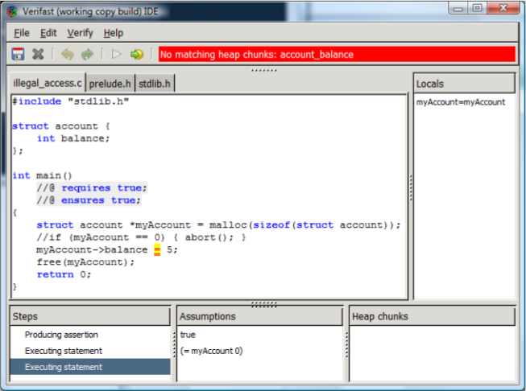
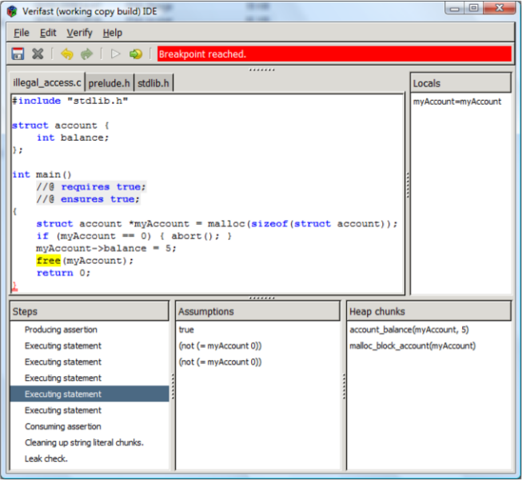
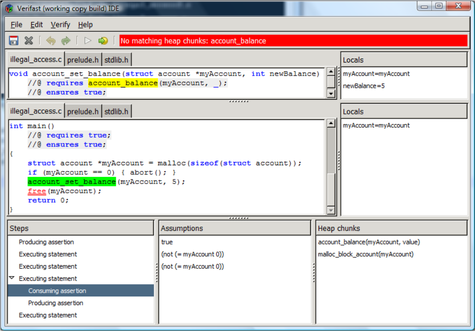

# プログラム検証器 VeriFast: チュートリアル

* 著者: Bart Jacobs, Jan Smans, Frank Piessens
* キーワード: iMinds-DistriNet, Department of Computer Science, KU Leuven - University of Leuven, Belgium
* 元文書発行日時: October 8, 2014
* 元文書: http://people.cs.kuleuven.be/~bart.jacobs/verifast/tutorial.pdf

## 1. 導入

VeriFast はシングルスレッドやマルチスレッドのC言語プログラム (VeriFast は Java もサポートしています; _VeriFast for Java: A Tutorial_ を読んでください) の性質が正しいことを検証するプログラム検証ツールです。
このツールは、1つ以上の .c ソースコードファイル (さらにそれらの .c ファイルから参照されている .h ヘッダファイル) から成るC言語プログラムを読み、「エラーが見つからなかった」とレポートするかエラーの可能性がある位置を示します。
もしこのツールが「0 errors found (エラーが見つからなかった)」とレポートしたなら、そのプログラムは次のようであることを意味しています
(このツールが時々「0 errors found」と間違ってレポートしてしまうのには (_不健全性_ (_unsoundnesses_) と呼ばれる) いくつかの理由があります; リファレンスマニュアルの「Known unsoundnesses」の章を読んでください; また知られていない不健全性もあるでしょう):

* 構造体インスタンスが解放された後にその構造体のフィールドを読み書きすることや、もしくは配列の終端を超えた読み書き (これは _バッファオーバフロー_ と呼ばれ、オペレーティングシステムやインターネットサービスにおけるセキュリティ脆弱性の最も多い原因です) のような、不正なメモリアクセスを行ないません。なおかつ
* データレース、すなわちマルチスレッドによる同じフィールドへの非同期な競合アクセス、として知られたある種の並行性のエラーを含みません。なおかつ
* 関数は、そのソースコード中の特殊なコメント (_注釈_ (_annotations_) と呼ばれます) でプログラマによって指示された、事前条件と事後条件に従っています。

不法なメモリアクセスやデータレースのようなC言語プログラムにおける多くのエラーは、テストやコードレビューのようなこれまでの手法では検出することが一般的にとても困難です。
なぜなら、それらはしばしば潜在的で、通常はわかりやすい故障を引き起こさず、そのくせ診断するのが困難な予測できない作用を持つからです。
けれども、オペレーティングシステム、デバイスドライバ、(電子商取引やインターネットバンキングを扱う) Web サーバ、自動車に対する組み込みソフトウェア、航空機、宇宙関連、原子力発電所や化学プラントなどのような、多くのセキュリティと安全性が要求されたプログラムはC言語で書かれます。
そしてこれらのプログラミングエラーはサイバー攻撃や損傷を可能にするのです。
そのようなプログラムにとって、VeriFast のような形式的な検証器によるアプローチは、要求されたレベルの信頼性を達成するもっとも効果的な方法になりえます。

全てのエラーを検出するために、VeriFast はプログラムに対して _モジュラーシンボリック実行_ (_modular symbolic execution_) を行ないます。
特に、VeriFast はプログラムのそれぞれの関数本体をシンボリックに実行します。
関数の事前条件によって表現されたシンボリック状態 (symbolic state) から開始し、命令文によってアクセスされたそれぞれのメモリ位置に対してシンボリック状態中に _パーミッション_ (_permissions_) が存在するかチェックし、それぞれの命令文の作用を考慮するためにシンボリック状態を更新し、そして関数が返るときに最終的なシンボリック状態が関数の事後条件を満たすことをチェックします。
シンボリック状態は1つの _シンボリックヒープ_ (_symbolic heap_)から成ります。
そのシンボリックヒープは、あるメモリ位置へのアクセスに対する複数の (_チャンク_ (_chunks_) とも呼ばれる) パーミッション、1つの _シンボリックストア_ (_symbolic store_)、それぞれのローカル変数へのシンボリック値 (symbolic value) の割り当て、そして1つの _パスコンディション_ (_path condition_) を含みます。
このときパスコンディションは、現時点の実行パスのシンボリック状態で使われている _シンボル_ (_symbols_) の値に関する _仮定_ (_assumptions_) の集合です。
シンボリック実行は常に停止します。
なぜならループ不変条件の使用のおかげで、それぞれのループ本体はたった一度だけシンボリックに実行され、関数呼び出しのシンボリック実行ではその事前条件と事後条件だけを使い、その本体は使用しないからです。

筆者らは現在ツールの機能を少しずつ作成している最中です。
このチュートリアルにある例や練習問題を試してみたい方は、次の VeriFast ウェブサイトから VeriFast をダウンロードしてください:

* http://www.cs.kuleuven.be/~bartj/verifast/

コマンドラインのツール (`verifast.exe`) と GUI のツール (`vfide.exe`) を `bin` ディレクトリに見つかるでしょう。

## 2. 例: illegal_access.c

どのように VeriFast を使用してテストやコードレビューで発見することが困難なプログラミングエラーを検出できるか説明するために、捉えにくいエラーを含むとても単純なC言語プログラムにこのツールを適用することからはじめましょう。

次からダウンロードできる `illegal_access.c` プログラムと一緒に `vfide.exe` を起動してくさださい:

http://www.cs.kuleuven.be/~bartj/verifast/illegal_access.c

VeriFast IDE にそのプログラムが表示されるでしょう。
そのプログラムを検査するために、__Verify__ メニューの __Verify program__ コマンドを選択するか、__Play__ ツールバーボタンを押すか、F5 キーを押してください。
下図のような結果になるでしょう。



このプログラムは _malloc_ を使って確保した構造体インスタンス `myAccount` のフィールド `balance` にアクセスしようと試みます。
けれども、もしメモリが不足していたら、_malloc_ はゼロを返してメモリは確保されません。
VeriFast はこのような場合に起きる不正なメモリアクセスを検出します。
次の GUI の要素に注意してください:

* 誤ったプログラムの要素が二重下線ともなって赤色で表示されます。
* "No matching heap chunks: account balance" というエラーメッセージが表示されます。実際メモリが不足した場合には、プログラムがアクセスを試みるメモリ位置 (もしくは _ヒープチャンク_ (_heap chunk_)) はアクセス可能ではありません。`account_balance` は `account` 構造体インスタンスの `balance` を表わすヒープチャンクの型です。
* 代入文が黄色バックグラウンドで表示されています。これはその代入文が _現在のステップ_ (_current step_) であるためです。関係するプログラム状態のシンボリック表現のトラックを保持しながら、そこへのステップで VeriFast はそれぞれの関数を検証します。VeriFast ウィンドウの左下コーナーの Steps ペインでステップを選択することで、それぞれのステップでのシンボリック状態を検査できます。その現在のステップに相当するプログラムの要素は黄色バッグラウンドで表示されます。シンボリック状態は、Assumptions ペインに表示された _パスコンディション_ と; Heap chunks ペインに表示された _シンボリックヒープ_ と; Locals ペインに表示された _シンボリックストア_ で構成されます。

このエラーを修正するために、コメント化された命令文のコメントをはずしてください。
そして再び F5 を押してください。
これでプログラムは検証され、Steps ペインにシンボリック実行パスは表示されません。

`main` 関数のシンボリック実行を検査するために、カーソルを最後の行 (すなわち関数本体を閉じる括弧) に置いて __Verify__ メニューから __Run to cursor__ コマンドを選択するか、__Run to cursor__ ツールバーボタンを押すか、Ctrl+F5 を押してください。(下図を見てください。)



カーソルまでの実行とはそのカーソルに至る実行パスを示すことを意味しています。
一般的に、そのようなパスは複数存在する可能性がありさう; この場合 (そのプログラムテキストによって誘導された分岐の順によって導入されたパスの順番での) その最初のパスが選ばれます。
この例では、唯一1つのパスのみ存在します。

どのように VeriFast がメモリの状態を追跡するのか理解するために、図のように Steps ペインの5番目のステップを選択してください。
_free_ 命令文が次に実行される文です。
このステップでは、そのシンボリックヒープは2つのヒープチャンクを含んでいます: `account_balance(myAccount, 5)` と `malloc_block_account(myAccount)` です。
1つ目のヒープチャンクは、アドレス `myAccount` にある `account` 構造体インスタンスの `balance` フィールドはプログラムからアクセス可能で、値 5 を持つという事実を意味しています。
2つ目のヒープチャンクは、プログラムはアドレス `myAccount` にあるメモリブロックを解放する許可を持つという事実を意味しています。
次のステップを選択すれば、_free_ 命令文がシンボリックヒープからこの両方のヒープチャンクを削除することに気が付くでしょう。
実際には、この構造体インスタンスの解放は、その構造体インスタンスのフィールドへのアクセスの許可と、その構造体インスタンスを解放する許可の両方を削除します。
これは不正なメモリアクセスと二重解放エラーを防止します。

## 3. malloc block チャンク

なぜ _malloc_ 命令文が `account_balance` チャンクと `malloc_block_account` チャンクの両方を生成するのかをより理解するために、ヒープに確保される代わりにスタック上のローカル変数として構造体インスタンスが確保されるようにプログラムを変更しましょう:

```c
int main()
    //@ requires true;
    //@ ensures true;
{
    struct account myAccountLocal;
    struct account *myAccount = &myAccountLocal;
    myAccount->balance = 5;
    free(myAccount);
    return 0;
}
```

はじめに、このプログラムはスタックに構造体 `account` のインスタンスを確保し、それを `myAccountLocal` と呼びます。
それからこの構造体インスタンスのアドレスをポインタ値 `myAccount` に割り当てます。
プログラムの残りは以前と同じです: プログラムは `balance` フィールドを値 5 に初期化し、それからその構造体インスタンスを解放しようと試みます。

もし VeriFast にこのプログラムを検証させると、VeriFast は _free_ 命令文で次のエラーをレポートします:

`No matching heap chunks: malloc block account(myAccountLocal addr)`

実際この _free_ は正しくありません。
なぜなら _free_ は `malloc` でヒープに確保された構造体インスタンスにのみ適用され、ローカル変数としてスタックに確保された構造体インスタンスには適用できないからです。

VeriFast はこのエラーを次のように検出します:
1) VeriFast は _malloc_ を使って確保された構造体インスタンスにのみ `malloc_block` チャンクを生成します。このチャンクはスタックに確保された構造体インスタンスを表わしません。
2) _free_ 命令文を検証するとき、その構造体が解放されるために VeriFast は `malloc_block` チャンクが存在することをチェックします。

その一方で、`account_balance` チャンクはどちらの場合も生成されることに注意してください。
結果的に、構造体インスタンスがヒープに確保されたかスタックに確保されたかどうかにかかわらず、`balance` フィールドを初期化する命令文は検証に成功します。

## 4. 関数と契約

前の章の例からはじめます。
今の時点ではこの例は唯一1つの関数から成ります: それは main 関数です。
別の関数を追加してみましょう。
`account` 構造体インスタンスのアドレスと整数の金額を取り、その金額を構造体インスタンスの `balance` フィールドに割り当てる関数 `account_set_balance` を書きます
そして main 関数のフィールド割り当てをこの関数呼び出しで置き換えます。
ここで次のプログラムを考えましょう:

```c
#include "stdlib.h"

struct account {
    int balance;
};

void account_set_balance(struct account *myAccount, int newBalance)
{
    myAccount->balance = newBalance;
}

int main()
    //@ requires true;
    //@ ensures true;
{
    struct account *myAccount = malloc(sizeof(struct account));
    if (myAccount == 0) { abort(); }
    account_set_balance(myAccount, 5);
    free(myAccount);
    return 0;
}
```

新しいプログラムを検査すると、VeriFast はこの新しい関数が契約を持っていないとエラーを出します。
実際、VeriFast はそれぞれの関数を別々に検査します。
そのため、それぞれの関数に関数呼び出しの初期状態と最終状態を表現する事前条件と事後条件が必要です。

main 関数が持つのと同じ契約を追加しましょう:

```c
void account_set_balance(struct account *myAccount, int newBalance)
    //@ requires true;
    //@ ensures true;
```

全ての VeriFast 注釈と同様に、契約はコメント中に置かれるので、C言語コンパイラはそれらを無視することに注意してください。
(@) 記号でマークされたコメントを除いて、VeriFast もコメントを無視します。

これでもはや VeriFast は契約の欠落に関するエラーを出さなくなりました。
けれども今度は、`account_set_balance` 本体のフィールド割り当てが検査できないというエラーが出ます。
なぜなら、そのシンボリックヒープはこのフィールドへのアクセスを許可するヒープチャンクを含まないからです。
これを修正するために、関数の事前条件で、その関数がアドレス `myAccount` の `account` 構造体インスタンスの `balance` フィールドへのアクセスに対する許可を要求することを明記しなければなりません。
事前条件にヒープチャンクを書くことで、この修正を行ないましょう:

```c
void account_set_balance(struct account *myAccount, int newBalance)
    //@ requires account_balance(myAccount, _);
    //@ ensures true;
```

フィールドの値がある位置にアンダースコアを使っていることに注意してください。
これは、この関数が呼び出された時に、そのフィールドの古い値について関心がないことを示しています。
(また VeriFast はフィールドチャンクに対してより完結な構文をサポートしています。
例えば、`account_balance(myAccount, _)` は `myAccount->balance |-> _` と書くこともできます。
実際には一般に、後者の (フィールドチャンク固有の) 構文は前者の (総称チャンク) 構文よりも推奨されています。
なぜならそれは VeriFast に、与えられたフィールドを表わすチャンクが最大1つあり、そのフィールドの値がその型の制限内であるというフィールドチャンク固有の情報を考慮させるからです。
けれども、注釈に書かれたチャンクと VeriFast IDE で表示されるヒープチャンクが同じ見た目になるように、このチュートリアルでは初めは総称チャンク構文を使います。)

これで VeriFast は関数本体を閉じる括弧をハイライトします。
これはフィールド割り当ての検証に成功したことを意味しています。
けれども、VeriFast はこの関数がヒープチャンクをリークしているというエラーを表示します。
さしあたって単純に、このヒープチャンクのリークを許すことを示す `leak` コマンドを挿入してこのエラーメッセージを回避しましょう。
後にこの問題に戻ってくることにします。

```c
void account_set_balance(struct account *myAccount, int newBalance)
    //@ requires account_balance(myAccount, _);
    //@ ensures true;
{
    myAccount->balance = newBalance;
    //@ leak account_balance(myAccount, _);
}
```

これで関数 `account_set_balance` は検査され、VeriFast は関数 `main` を検査しようと試みます。
この検査は `account` 構造体インスタンスを解放できないというエラーを出力します。
なぜなら、`balance` フィールドへのアクセス許可を持たないからです。
実際、そのシンボリックヒープは `malloc_block_account` チャンクを含みますが、`account_balance` チャンクを含みません。
何が起きたのでしょうか？
シンボリック実行パスをステップ実行して調べてみましょう。
2番目のステップを選択します。
`malloc` 命令文が実行されようとしており、そのシンボリックヒープは空です。
次のステップを選択します。
`malloc` 命令文が `account_balance` チャンクと `malloc_block_account` チャンクを追加しました。

if 命令文は作用がありません。

そうして `account_set_balance` を呼び出します。
この実行ステップは "Consuming assertion" と "Producing assertion" という名前の2つの子ステップを持つことに気が付くでしょう。
関数呼び出しの検証は、関数の事前条件の _消費_ (_consuming_) とその後の関数の事後条件の _生成_ (_producing_) から成ります。
事前条件と事後条件は _表明_ (_assertions_)、すなわち通常の論理に加えてヒープチャンクを含むような式です。
事前条件の消費は、その関数から要求されたヒープチャンクをその関数に渡すことを意味し、従ってそれらをシンボリックヒープから削除します。
事後条件の生成は、その関数が返るときにその関数から提示されたヒープチャンクを受け取ることを意味し、従ってそれらをンボリックヒープに追加します。



"Consuming assertion" ステップを選択すると VeriFast ウィンドウのレイアントが変わります (上図を見てください)。
ソースコードペインが2つの部分に分かれます。
上の部分は呼び出された関数の契約を表示するのに使われ、下の部分は検査される関数を表示するのに使われます。
(この例では呼び出される関数は検査される関数と近接しているので、上と下のパートは同じものが表示されます。)
検査される呼び出しが緑色バックグラウンドで表示されます。
消費/生成される契約は黄色バックグラウンドで表示されます。
"Consuming assertion" ステップから "Producing assertion" ステップに移ると、"Consuming assertion" ステップがシンボリックヒープから `account_balance` チャンクを削除することに気が付くでしょう。
ここでは概念上、`main` 関数が `account_set_balance` 関数の返りを待つ間、それはこの関数によって使われます。
関数 `account_set_balance` の事後条件はヒープチャンクに言及していないので、"Producing assertion" ステップはシンボリックヒープに何も追加しません。

ここでは VeriFast が `account_set_balance` がヒープチャンクをリークしたとエラーを出すのかは明確です:
この関数は `account_balance` チャンクをその呼び出し元に返さないため、そのチャンクは失われ、そのフィールドは再びアクセスすることができないのです。
これは通常プログラマの意図ではないので、VeriFast はこれをエラーをみなします;
さらに、より多くのメモリ位置がリークしたら、そのプログラムはメモリ不足になるでしょう。

このエラーを修正する方法も明確です:
関数 `account_set_balance` の事後条件にこの関数が `account_balance` チャンクを呼び出し元に返すことを指定すべきです。

```c
void account_set_balance(struct account *myAccount, int newBalance)
    //@ requires account_balance(myAccount, _);
    //@ ensures account_balance(myAccount, newBalance);
{
    myAccount->balance = newBalance;
}
```

これはリークエラーメッセージと _free_ 命令文のエラーを取り除きます。
これでこのプログラムは検査されました。
フィールドの値が属する位置で `newBalance` パラメータを参照していることに注意してください;
これは関数が返る時のこのフィールドの値がこのパラメータの値と等しいことを意味しています。

__練習問題 1__
`account` 構造体インスタンスの生成と破棄を関数に切り出してください。
その生成関数は `balance` をゼロで初期化すべきです。
注意: 表明で複数のヒープチャンクを使うには、それらを分離論理積 `&*&` (アンパサンド-スター-アンパサンド) を使って区切ってください。
また事後条件では関数の返り値を `result` の名前で参照できます。

## 5. パターン

現在の `balance` を返す関数を追加し、それを main 関数で使ってみましょう。
次のコードが最初の試みです:

```c
int account_get_balance(struct account *myAccount)
    //@ requires account_balance(myAccount, _);
    //@ ensures account_balance(myAccount, _);
{
    return myAccount->balance;
}

int main()
    //@ requires true;
    //@ ensures true;
{
    struct account *myAccount = create_account();
    account_set_balance(myAccount, 5);
    int b = account_get_balance(myAccount);
    assert(b == 5);
    account_dispose(myAccount);
    return 0;
}
```

新しい関数の検査は成功しますが、VeriFast は条件 `b == 5` を証明できないというエラーを返します。
VeriFast は条件のチェックを要求されると、はじめに、それぞれの変数をシンボリック値で置換することで、その条件を論理式に変換します。
Locals ペインに表示されたシンボリックストアに、変数 `b` のシンボリック値が論理記号 `b` であることを見つけることができます。
そのため、結果の論理式は `b == 5` です。
それから VeriFast は _パスコンディション_ 、すなわち Assumptions ペインに表示されている式、からこの式を導出しようと試みます。
この場合唯一の仮定は __true__ なので、VeriFast はこの条件を証明できないのです。

この問題は関数 `account_get_balance` 事後条件はこの関数の返り値を指定していないことによります。
その返り値が関数が呼ばれたときの `balance` フィールドの値と等しいと言明していないのです。
これを修正するために、関数が呼ばれたときの `balance` フィールドの値に名前を割り当てられるようにする必要があります。
これは事前条件のアンダースコアを _パターン_ `?theBalance` で置換することで可能です。
これで名前 `theBalance` は `balance` フィールドの値に束縛されるようになります。
等価条件で使う返り値指定するために、事後条件でこの名前を使うことができます。
関数の返り値は関数のその関数の事後条件で `result` の名前で使えます。
表明における論理条件とヒープチャンクは分離論理積 `&*&` を使って区切ってください。

```c
int account_get_balance(struct account *myAccount)
    //@ requires account_balance(myAccount, ?theBalance);
    //@ ensures account_balance(myAccount, theBalance) &*& result == theBalance;
{
    return myAccount->balance;
}
```

事後条件のフィールド値の位置で使うことで、名前 `theBalance` はその関数が `balance` フィールドの値を修正しないことを指定するのにも使えることに注意してください。

これでこのプログラムは検査されました。
実際、__Run to cursor__ コマンドを使って assert 命令文まで実行すると、Assumptions ペインに仮定 `(= b 5)` が現われるでしょう。
ステップを戻すと、関数 `account_get_balance` の事後条件における等式条件が生成されたときに、その仮定が追加されたことが分かるでしょう。
さらステップを戻すと、フィールドチャンクの表明が消費されたときに、上の Locals ペインに変数 `theBalance` が追加され、その値が 5 に束縛されたことが分かるでしょう。
シンボリックヒープに値が見つかったので、それは値 5 に束縛されます。
関数呼び出しを検査するとき、上の Locals ペインはその呼び出される関数の契約を評価するのに使われます。
初期状態ではそれはその関数のパラメータからその呼び出しで指定された引数への束縛を含んでいます;
追加の束縛は契約にパターンを記述すると現われます。
仮定 `(= b 5)` は、上の Locals ペインで示されたシンボリックストアで、等式条件 `result == theBalance` を評価して得られる論理式です。

__練習問題 2__
与えられた金額を `account` に預ける関数を追加してください。
次の `main` 関数を検証してください。

```c
int main()
    //@ requires true;
    //@ ensures true;
{
    struct account *myAccount = create_account();
    account_set_balance(myAccount, 5);
    account_deposit(myAccount, 10);
    int b = account_get_balance(myAccount);
    assert(b == 15);
    account_dispose(myAccount);
    return 0;
}
```

注意: VeriFast は算術オーバーフローをチェックします。
ここでは、__Verify__ メニューでこのチェックを無効にしてください。

__練習問題 3__
`account` の最小 `balance` を指定するために、構造体 `account` にフィールド `limit` を追加してください。
(これは一般にゼロもしくは負の数になります。)
この `limit` は生成時に指定します。
さらに与えられた金額を `account` から引き出す関数を追加してください。
この関数は `limit` を配慮しなければなりません;
要求された金額の引き出しが `limit` に違反したら、`limit` の違反を除いて引き出し可能な最大の金額が引き出されます。
その関数は実際に引き出された金額をその返り値として返します。
C言語の条件式 `condition ? value1 : value2` を使うことになるでしょう。
関数 `account_set_balance` を削除してください。
フィールドチャンク `myAccount->balance |-> value` の略記を使ってください。
次の `main` 関数を検査してください。

```c
int main()
    //@ requires true;
    //@ ensures true;
{
    struct account *myAccount = create_account(-100);
    account_deposit(myAccount, 200);
    int w1 = account_withdraw(myAccount, 50);
    assert(w1 == 50);
    int b1 = account_get_balance(myAccount);
    assert(b1 == 150);
    int w2 = account_withdraw(myAccount, 300);
    assert(w2 == 250);
    int b2 = account_get_balance(myAccount);
    assert(b2 == -100);
    account_dispose(myAccount);
    return 0;
}
```

## 6. 述語

練習問題3で得られたプログラムからはじめましょう。
先の契約が成長するのを観察しました。
さらに `account` の "クラス" と、異なるモジュールである main 関数を考えると、`account` モジュールの内部実装詳細が main 関数に露出されてしまっています。
関数の契約に `account` 構造体インスタンスを表現する _述語_ (_predicate_) を導入することで、情報の隠蔽とより簡潔な契約を実現できます。

```c
/*@
predicate account_pred(struct account *myAccount, int theLimit, int theBalance) =
    myAccount->limit |-> theLimit &*& myAccount->balance |-> theBalance
    &*& malloc_block_account(myAccount);
@*/
```

述語は名前の付いたパラメータ化された表明です。
さらにそれはヒープチャンクの新しい型を導入します。
`account_pred` ヒープチャンクは、`account_limit` ヒープチャンク、`account_balance` ヒープチャンクと `malloc_block_account` ヒープチャンクを1つにまとめています。

この述語を使って、引き出し関数の契約を書き換えてみましょう。
最初の試みは次のようになります:

```c
void account_deposit(struct account *myAccount, int amount)
    //@ requires account_pred(myAccount, ?limit, ?balance) &*& 0 <= amount;
    //@ ensures account_pred(myAccount, limit, balance + amount);
{
    myAccount->balance += amount;
}
```

この関数は検査できません。
シンボリックヒープに `account_balance` ヒープチャンクがないので、`balance` フィールドの更新は検査できないのです。
そこには `account_pred` ヒープチャンクしかありません。
`account_pred` ヒープチャンクは `account_balance` ヒープチャンクをカプセル化していますが、VeriFast は述語 `account_pred` を自動的に取り出しません。
__open__ ゴースト命令文を挿入して、VeriFast に述語ヒープチャンクを取り出すよう指示する必要があります:

```c
void account_deposit(struct account *myAccount, int amount)
    //@ requires account_pred(myAccount, ?limit, ?balance) &*& 0 <= amount;
    //@ ensures account_pred(myAccount, limit, balance + amount);
{
    //@ open account_pred(myAccount, limit, balance);
    myAccount->balance += amount;
}
```

これでこの割り当ては検査されましたが、VeriFast は事後条件で停止します。
それは関数の呼び出し元へ返す `account_pred` ヒープチャンクが見つからないと訴えています。
`account_pred` チャンクを構成するチャンクはシンボリックヒープ中に存在し、VeriFast は自動的にそれらを `account_pred` チャンクにまとめません。
__close__ ゴースト命令文を使ってそれを行なうよう VeriFast に指示する必要があります:

```c
void account_deposit(struct account *myAccount, int amount)
    //@ requires account_pred(myAccount, ?limit, ?balance) &*& 0 <= amount;
    //@ ensures account_pred(myAccount, limit, balance + amount);
{
    //@ open account_pred(myAccount, limit, balance);
    myAccount->balance += amount;
    //@ close account_pred(myAccount, limit, balance + amount);
}
```

これでこの関数は検査されます。
けれども、`account_deposit` 呼び出しが `account_pred` ヒープチャンクを期待しているため、main 関数は検査できません。

__練習問題 4__
述語 `account_pred` を使って残りの契約を書き換えてください。
必要に応じて命令文 __open__ と __close__ を挿入してください。

## 7. 再帰的な述語

前章では、簡潔さと情報の隠蔽のために、述語を導入しました。
けれども、述語に対してさらなる切実な必要性があります:
それは VeriFast でサイズに再現のないデータ構造を表現する唯一の方法なのです。
実際、述語がない場合、表明で表現されるメモリ位置の数はその表明の長さに比例します。
この制限は再帰的な述語、すなわち自分自身を呼び出す述語、を使うことで克服できます。

__練習問題 5__
片方向リストデータ構造を使って整数のスタックを実装してください:
関数 `create_stack`, `stack_push`, `stack_pop`, `stack_dispose` を実装してください。
`stack_pop` の事前条件を指定できるようにするために、述語はスタック中の要素の数を指定するパラメータを持つ必要があります。
関数 `stack_dispose` は空のスタックにのみ呼び出すことができます。
スタックの中身を指定しないでください; これまで見てきた注釈ではそれは不可能です。
条件文の表明 `condition ? assertion1 : assertion2` を使う必要があります。
注意: __open__ 命令文中でのフィールドのデリファレンスを VeriFast は許しません。
__open__ 命令文中でフィールドの値を使いたい場合、はじめにその値をローカル変数に保存しなければなりません。
次の main 関数を検査してください:

```c
int main()
    //@ requires true;
    //@ ensures true;
{
    struct stack *s = create_stack();
    stack_push(s, 10);
    stack_push(s, 20);
    stack_pop(s);
    stack_pop(s);
    stack_dispose(s);
    return 0;
}
```

ここで、練習問題5の答を拡張して `stack_is_empty` 関数を作ってみましょう。
述語定義を思い出してみましょう:

```c
predicate nodes(struct node *node, int count) =
    node == 0 ?
        count == 0
    :
        0 < count
        &*& node->next |-> ?next &*& node->value |-> ?value
        &*& malloc_block_node(node) &*& nodes(next, count - 1);

predicate stack(struct stack *stack, int count) =
    stack->head |-> ?head &*& malloc_block_stack(stack) &*& 0 <= count &*& nodes(head, count);
```

次は `stack_is_empty` 関数の最初の試みです:

```c
bool stack_is_empty(struct stack *stack)
    //@ requires stack(stack, ?count);
    //@ ensures stack(stack, count) &*& result == (count == 0);
{
    //@ open stack(stack, count);
    bool result = stack->head == 0;
    //@ close stack(stack, count);
    return result;
}
```

この関数は検査できません。
VeriFast は事後条件の条件式 `result == (count == 0)` を証明できないとエラーを吐きます。
実際、Assumptions ペインの仮定を見てみると、それらの仮定はこの条件を証明するのに不十分です。
この問題は head ポインタの値と nodes の数との関係が述語 `nodes` の中に隠されてしまっていることです。
その情報を仮定に追加するために、その述語を開く必要があります。
もちろん、述語 `stack` を閉じられるように、その後その述語を再び閉じなければなりません。

```c
bool stack_is_empty(struct stack *stack)
    //@ requires stack(stack, ?count);
    //@ ensures stack(stack, count) &*& result == (count == 0);
{
    //@ open stack(stack, count);
    struct node *head = stack->head;
    //@ open nodes(head, count);
    bool result = stack->head == 0;
    //@ close nodes(head, count);
    //@ close stack(stack, count);
    return result;
}
```

これでこの関数は検査できます。
正確に起きることは次のようなものです。
VeriFast が open 命令文を実行すると、述語 `nodes` の本体中に条件表明を生成します。
これは _場合分け_ (_case split_) の実行を引き起こします。
これはその関数の残りが二度検証されることを意味しています:
一度は条件が真である仮定において、もう一度は条件が偽である仮定においてです。
別の言い方をすると、その実行パスは2つの実行パス、もしくは _分岐_ (_branches_) に分かれるのです。
これで両方の分岐において、事後条件はたやすく証明できます:
1番目の分岐にでは仮定 `head == 0` と `count == 0` を得て、2番目の分岐では `head != 0` と `0 < count` を得ます。

__練習問題 6__
関数 `stack_dispose` を修正して、スタックが要素を含んでいても動くようにしてください。
再帰的なヘルパー関数を使ってください。
(警告: VeriFast は停止性を検証しません;
無限再帰や無限ループをエラーにしないのです。
それはあなた自身の責務です。)

__if__ 命令文を検証するとき、VeriFast は場合分けを行なうことに注意してください。

__練習問題 7__
スタックの要素の値の合計を返す関数 `stack_get_sum` を追加してください。
再帰的なヘルパー関数を使ってください。
(まだどうやってするのか分からないので) 契約は返り値を指定する必要はありません。

## 8. ループ

練習問題6では、再帰関数を使って `stack_dispose` を実装しました。
けれども、これは最善の実装ではありません。
データ構造がとても多くの要素を含んでいると、あまりに多くのスタックフレーム生成してコールスタックがあふれてしまうかもしれません。
より良い実装はループを使った関数です。
次のコードは最初の試みです:

```c
void stack_dispose(struct stack *stack)
    //@ requires stack(stack, _);
    //@ ensures true;
{
    //@ open stack(stack, _);
    struct node *n = stack->head;
    while (n != 0)
    {
        //@ open nodes(n, _);
        struct node *next = n->next;
        free(n);
        n = next;
    }
    //@ open nodes(0, _);
    free(stack);
}
```

この関数は検証できません。
このループはループ不変条件を指定していないので、VeriFast はこのループでエラーになります。
VeriFast がループ不変条件を必要としているのは、(最初の反復のみではなく) 任意のループ反復の開始を表わすシンボリック状態からはじめて、ループ本体を一度検証することでループ反復の任意の順序を検証できるようにするためです。

具体的には VeriFast はループを次のように検証します:

* はじめに、ループ不変条件を消費します。
* それから、ヒープから残りのヒープチャンクを削除します (しかしそれらは記憶されています)。
* それから、ループ本体で変更されたそれぞれのローカル変数に新鮮な論理記号を割り当てます。
* それから、ループ不変条件を生成します。
* それから、ループ条件の場合分けを行ないます:
    * もし条件が真なら:
        * ループ本体を検証し、
        ∗ それから、ループ不変条件を消費し、
        ∗ それから最後に、リークをチェックします。このステップの後、この実行パスは終了します。
    * もし条件が偽なら、VeriFast はステップ2で削除されたヒープチャンクをヒープに戻し、それからループの後から検証を続けます。

これは、ループがそのループ不変条件中で言及されたヒープチャンクのみアクセス可能であることを意味することに注意してください。

上記の関数に対する正しいループ不変条件は次のようになります:

```c
void stack_dispose(struct stack *stack)
    //@ requires stack(stack, _);
    //@ ensures true;
{
    //@ open stack(stack, _);
    struct node *n = stack->head;
    while (n != 0)
        //@ invariant nodes(n, _);
    {
        //@ open nodes(n, _);
        struct node *next = n->next;
        free(n);
        n = next;
    }
    //@ open nodes(0, _);
    free(stack);
}
```

xxx
